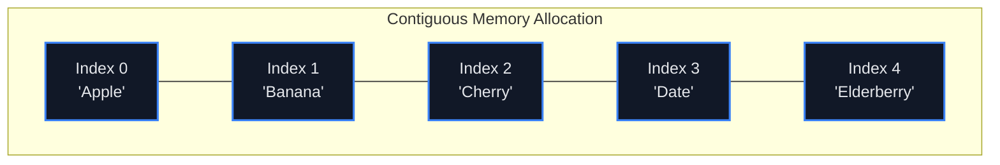

## Concept

An **Array** is a linear data structure that stores a collection of elements.
In low-level languages like C or Go, an array is a single, continuous block of physical memory. If you declare an array of 5 integers, the CPU reserves exactly 5 adjacent slots in the RAM.

Because the memory is continuous, the CPU knows exactly where every item lives based on simple math: `Memory_Address = Start_Address + (Index * Item_Size)`.
This makes reading an item from an array incredibly fast.

## Mental Model

Imagine a row of identical mailboxes numbered 0 through 4.
If you want to read mailbox #3, you don't have to open mailbox #0, #1, and #2 first. You just walk straight to mailbox #3 and open it instantly.

## Time Complexity

| Operation | Time Complexity | Explanation |
| :--- | :--- | :--- |
| **Access (Read)** | $O(1)$ | Direct memory address calculation. |
| **Search (Unsorted)** | $O(N)$ | Must check every item until found. |
| **Insert/Delete (End)** | Amortized $O(1)$ | Just add it to the very next empty slot. |
| **Insert/Delete (Start/Middle)** | $O(N)$ | Must physically shift every subsequent item over to make room (or close the gap). |

## Static vs Dynamic Arrays

- **Static Arrays (C, Java `int[]`):** Have a fixed size defined at creation. `int arr[5];`. You cannot add a 6th item. You must create a brand new array of size 10 and copy the items over manually.
- **Dynamic Arrays (JavaScript `[]`, Python `list`, Java `ArrayList`):** Automatically resize themselves under the hood. When they fill up, they automatically allocate a new, twice-as-large memory block and copy the old items over. Pushing an item is **Amortized $O(1)$**.

## Interview Strategy

Arrays are the most common data structure in interviews. When faced with an Array problem, your mind should immediately jump to these 5 classic patterns:
1. **Is the array sorted?** -> Use Binary Search or Two Pointers.
2. **Are you looking for a subarray/substring?** -> Use a Sliding Window.
3. **Does it require range sum queries?** -> Use a Prefix Sum.
4. **Does it require pairing items up?** -> Use a Hash Map for fast $O(1)$ lookups instead of nested loops.
5. **Can you modify the array?** -> Sort it first, or modify it "in-place" to save space complexity.

## Interview Questions

**Q: Why do arrays start at index 0 instead of 1?**
**A:** Because the index is mathematically an **offset** from the starting memory address.
If the array starts at memory address `1000`, and each item is `4` bytes:
- To find the *first* item (offset 0): `1000 + (0 * 4) = 1000`.
- To find the *second* item (offset 1): `1000 + (1 * 4) = 1004`.
If arrays started at 1, the CPU would have to subtract 1 every single time it calculated an address (`1000 + ((Index - 1) * 4)`), which adds unnecessary computational overhead.

**Q: A developer uses Javascript's `.splice(0, 1)` or `.shift()` to remove the first item from an array of 100,000 items inside a `while` loop. Why does the application completely freeze?**
**A:** Removing the first item from an array is an **$O(N)$** operation. The CPU has to physically move the remaining 99,999 items one slot to the left to close the gap. Doing an $O(N)$ operation inside an $O(N)$ `while` loop creates an **$O(N^2)$** algorithm.
To fix this, the developer should use a `Queue` data structure (or a simple pointer that increments), which allows $O(1)$ removal from the front.
