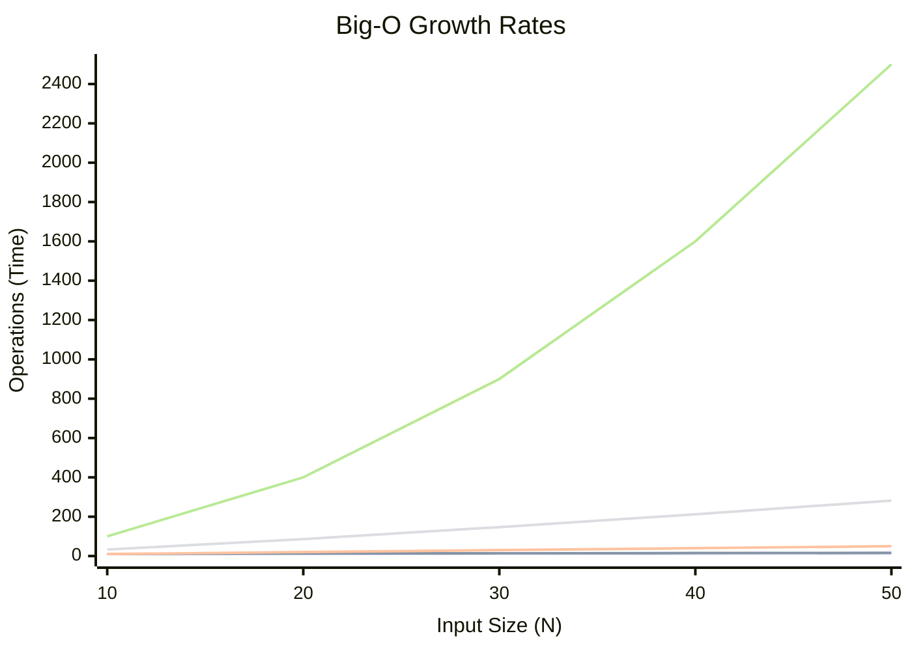

## Concept

In computer science, **Big-O Notation** (e.g., $O(N)$) is a mathematical shorthand used to classify algorithms according to how their running time or space requirements grow as the input size grows.

Crucially, **Big-O specifically describes the Worst-Case Scenario (the Upper Bound).**

## Why do we only care about the Worst Case?

Imagine you write an algorithm to find the number `7` in an unsorted array: `[7, 2, 9, 4, 1]`.
- **Best Case:** The `7` is the very first item. The algorithm finishes in 1 step ($O(1)$).
- **Worst Case:** The `7` is the very last item, or isn't in the array at all. The algorithm has to check every single item ($O(N)$).

If you tell a Senior Engineer: *"My algorithm is $O(1)$ fast!"*, you are lying. It was only fast by pure luck. When designing systems that process billions of rows of data, engineers must plan for the absolute worst-case scenario to guarantee the system won't crash. Therefore, we define Linear Search strictly as an **$O(N)$** algorithm.

## Formal Mathematical Definition

In formal academia, saying an algorithm is $O(f(n))$ means:
*"The algorithm's runtime will never grow faster than a constant multiple of $f(n)$, for all inputs larger than some minimum size."*

In plain English: **Big-O puts a ceiling on how bad things can get.**

If an algorithm is $O(N^2)$, it means the runtime is guaranteed to be less than or equal to $c \cdot N^2$. It will never accidentally explode into $O(N^3)$.

## Visualizing Big-O Growth

Notice how $O(N^2)$ (the red line) shoots directly upward. For $N=50$, an $O(N)$ algorithm takes 50 steps, but an $O(N^2)$ algorithm takes 2,500 steps. This is why nested loops are so dangerous in software engineering.

## Interview Questions

**Q: A developer writes a function that loops through an array twice (sequentially, not nested). They claim the time complexity is $O(2N)$. Is this correct notation?**
**A:** No. In Big-O notation, we strictly drop all constants. $O(2N)$, $O(100N)$, and $O(N / 2)$ all mathematically scale at the exact same linear rate as $N \rightarrow \infty$. Therefore, the correct notation is simply **$O(N)$**. Big-O describes the *shape of the curve*, not the exact number of operations.

**Q: Is Quick Sort an $O(N \log N)$ algorithm?**
**A:** Technically, no. 
While Quick Sort's *Average Case* is exceptionally fast at $O(N \log N)$, Big-O strictly defines the *Worst-Case Scenario*. 
If you pass a completely sorted array into a naive Quick Sort implementation, the pivot selection mathematically fails, and the algorithm degrades to comparing every single item against every other item. Therefore, the formal Big-O of Quick Sort is actually **$O(N^2)$**. (This is a common trick question).
