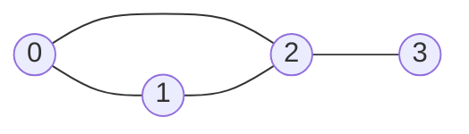

## Concept

An **Adjacency List** is the most common and optimal way to represent a Graph in code.

It is implemented using a **Hash Map** (or an Array if the nodes are strictly numbered $0$ to $N-1$). 
- **The Key:** The Node.
- **The Value:** An Array of all the neighbor nodes it is directly connected to.

## Mental Model



**Adjacency List Representation:**
```json
{
  "0": [1, 2],
  "1": [0, 2],
  "2": [0, 1, 3],
  "3": [2]
}
```

Notice how in an **Undirected Graph**, the connection is recorded twice. Node `0` lists `1` as a neighbor, and Node `1` lists `0` as a neighbor. 

If this were a **Directed Graph** (`0 -> 1`), Node `0` would list `1`, but Node `1` would *not* list `0`.

## Building the Adjacency List

In LeetCode, Graph problems rarely hand you a pre-built Adjacency List. 
Instead, they hand you an integer `n` (number of nodes), and an **Edge List** (an array of pairs like `[[0,1], [0,2], [1,2]]`).

Your absolute first step in ANY Graph problem is to loop over the Edge List and build the Adjacency List yourself.

```typescript
// Example Input: n = 4, edges = [[0,1], [0,2], [1,2], [2,3]]

function buildGraph(n: number, edges: number[][]): Map<number, number[]> {
    const adjList = new Map<number, number[]>();

    // 1. Initialize empty arrays for every single node
    for (let i = 0; i < n; i++) {
        adjList.set(i, []);
    }

    // 2. Populate the connections
    for (let [src, dest] of edges) {
        // Add destination to the source's list
        adjList.get(src)!.push(dest);
        
        // IF UNDIRECTED: Add source to the destination's list too!
        adjList.get(dest)!.push(src); 
    }

    return adjList;
}
```

## Why is it the Gold Standard?

1. **Space Complexity:** $O(V + E)$ (Vertices + Edges). It only stores the exact physical connections that actually exist. This is incredibly memory efficient for "Sparse Graphs" (like Facebook, where there are 2 Billion users, but you are only friends with 500 of them).
2. **Finding Neighbors:** $O(1)$ time to access a node's list of neighbors.
3. **Iterating over Neighbors:** You instantly get an array of exactly the connected nodes, allowing fast DFS/BFS traversal.

## Interview Questions

**Q: If you are building a Weighted Graph, how does the Adjacency List change?**
**A:** Instead of the Hash Map value being an array of just numbers, it becomes an array of **Tuples or Objects** containing both the destination node AND the weight of that edge. 
Example: `{ "A": [ { node: "B", weight: 50 }, { node: "C", weight: 10 } ] }`.

**Q: A developer uses a standard JS Object `{}` for the Adjacency List instead of a `Map`. The nodes in the problem are string names like "Alice" and "Bob". Is this acceptable?**
**A:** Yes, for Graph Adjacency Lists where the nodes are primitives (Strings or Integers), using a standard `{}` object is very common and perfectly acceptable. However, if the nodes in the problem are actual physical Objects (like `new Node()`), you MUST use a `Map` because standard JS objects cannot use objects as keys.
