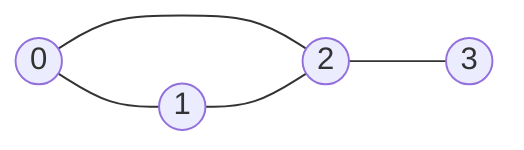

## Concept

An **Adjacency Matrix** is a 2D Array (a grid) used to represent a Graph.

If a Graph has `N` nodes, the Adjacency Matrix is strictly an `N x N` grid.
- The rows represent the Source node.
- The columns represent the Destination node.
- The cell `matrix[row][col]` contains a `1` if an edge exists, and a `0` if it does not. (If it is a Weighted graph, the cell contains the numeric weight).

## Mental Model

**Adjacency Matrix Representation:**
| | 0 | 1 | 2 | 3 |
| :--- | :--- | :--- | :--- | :--- |
| **0** | 0 | 1 | 1 | 0 |
| **1** | 1 | 0 | 1 | 0 |
| **2** | 1 | 1 | 0 | 1 |
| **3** | 0 | 0 | 1 | 0 |

Notice the **Diagonal of Zeroes**. A node is generally not connected to itself (unless the graph explicitly allows "self-loops").
Also, notice the symmetry. In an Undirected graph, if `matrix[0][1]` is `1`, then `matrix[1][0]` MUST also be `1`.

## Pros and Cons

**Pros:**
- **Instant Edge Lookup:** If you want to know "Is Node A connected to Node B?", you just check `matrix[A][B]` in $O(1)$ time. (In an Adjacency List, you would have to search Node A's entire array of neighbors, taking $O(Degree)$ time).
- Excellent for highly dense graphs where almost every node is connected to every other node.

**Cons:**
- **Catastrophic Space Complexity:** $O(V^2)$. If Facebook has 2 Billion users, the matrix requires $2,000,000,000 \times 2,000,000,000$ cells in RAM. Because most people only have 500 friends, 99.99% of that massive grid will just be empty `0`s. This is a massive waste of memory.
- **Slow Neighbor Iteration:** If you are at Node A, and you want to visit its neighbors, you are forced to iterate through the entire Row of length $V$ checking for `1`s, even if Node A only has 1 real neighbor.

## When to use it?

You rarely choose to build an Adjacency Matrix yourself. 
However, many LeetCode problems (especially "Implicit Graph" problems) provide the input as an Adjacency Matrix by default.

For example, LeetCode 547: Number of Provinces. You are given an `n x n` matrix `isConnected` where `isConnected[i][j] = 1` if the i-th city and the j-th city are directly connected.

When the problem explicitly gives you the Matrix, you do not need to convert it into an Adjacency List. You just run your DFS/BFS directly on the 2D array, looping through the rows to find the `1`s.

## Interview Questions

**Q: If you are given an Adjacency Matrix, what is the time complexity to find all neighbors of a specific node?**
**A:** It is strictly **$O(V)$**, where $V$ is the total number of vertices in the entire graph. Even if the node only has 1 actual neighbor, you must physically iterate across the entire Row of length $V$ to check every single cell for a `1` or `0`. This is significantly slower than an Adjacency List, which takes $O(Degree)$ time (where Degree is just the actual number of connected neighbors).
