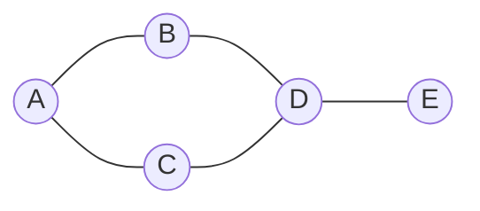
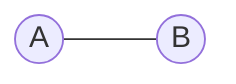
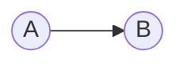
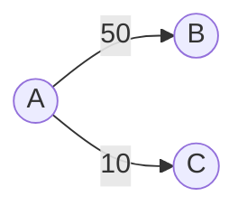

## Concept

If an Array is a straight line, and a Tree is a hierarchy, a **Graph** is a web.

A Graph is a mathematical structure used to model pairwise relations between objects. It consists of **Nodes** (also called Vertices) connected by **Edges**.

Graphs are the foundation of modern technology. They model:
- **Social Networks:** You are a Node. Your friends are Nodes. The friendship between you is an Edge.
- **Maps / GPS:** Cities are Nodes. The highways connecting them are Edges.
- **The Internet:** Computers are Nodes. Network cables are Edges.
- **The Web:** Web pages are Nodes. Hyperlinks are Edges.

## Graph Terminology

- **Vertex (Node):** The fundamental unit (A, B, C, D, E).
- **Edge:** The line connecting two vertices.
- **Path:** A sequence of edges connecting two vertices (e.g., A -> C -> D -> E).
- **Degree:** The number of edges connected to a specific vertex (e.g., D has a degree of 3).
- **Cyclic Graph:** A graph where a path can loop back to a starting node (A -> B -> D -> C -> A).
- **Acyclic Graph:** A graph with absolutely no cycles. *(Fun Fact: A Tree is just a specialized type of Directed Acyclic Graph!)*

## Directed vs Undirected

**Undirected Graph:**
The edges are two-way streets. If A is connected to B, then B is equally connected to A.
*Example: Facebook friendships. If I am your friend, you are my friend.*

**Directed Graph (Digraph):**
The edges are one-way streets (arrows). Just because A points to B, does NOT mean B points to A.
*Example: Twitter followers. I follow Elon Musk, but Elon Musk does not follow me.*

## Weighted vs Unweighted

**Unweighted Graph:**
Every edge is considered equal. Finding the "shortest path" just means finding the path with the fewest number of edges. (Solved via standard **Breadth-First Search**).

**Weighted Graph:**
Every edge has a numerical "cost" or "distance" assigned to it. The shortest path by *number of edges* might not be the fastest path by *weight*.
*Example: Google Maps. Highway 1 is 50 miles long (Weight: 50). Highway 2 is 10 miles long (Weight: 10).*
(Solved via **Dijkstra's Algorithm**).

## How to Represent a Graph in Code

Unlike a Binary Tree where you have a simple `root` variable to start from, a Graph is a chaotic web. Where do you start? How do you store it in a variable?

There are three ways to represent a Graph in code:
1. **Adjacency List:** The standard, highly-efficient approach used in 95% of all interviews.
2. **Adjacency Matrix:** A 2D grid, used for dense mathematical graphs.
3. **Edge List:** A simple flat array of `[Source, Destination]` pairs, often provided as the raw input in LeetCode problems. `[[A, B], [A, C], [C, D]]`. You usually convert this Edge List into an Adjacency List before starting your algorithm.

## Interview Strategy

When you see a Graph problem, you should immediately ask yourself 3 questions:
1. Is it Directed or Undirected? (Changes how you build the Adjacency List).
2. Is it Weighted or Unweighted? (Determines if you use BFS or Dijkstra's).
3. Can there be Cycles? (If yes, you MUST use a `Visited` Hash Set to prevent infinite loops).
