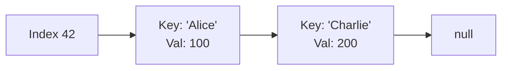

## Concept

In highly theoretical Google-level interviews, you may be asked to implement a Hash Table completely from scratch using only a primitive Array.

When you do this, you have to explicitly handle **Hash Collisions** (when your Hash Function accidentally maps "Alice" and "Charlie" to the exact same physical array index). 

There are two primary algorithms for handling collisions: **Separate Chaining** and **Open Addressing**.

## 1. Separate Chaining (The Standard Way)

This is how almost all modern languages (like Java's `HashMap`) handle collisions under the hood.

Instead of storing the exact Value inside the Array slot, every Array slot holds a pointer to a **Linked List**.
When "Alice" hashes to index `42`, we create a Node `{key: 'Alice', val: 100}` and put it at index 42.
When "Charlie" hashes to index `42`, we just traverse the Linked List at index 42 and append Charlie's Node to the very end of it.

**Pros:** It is simple. The Hash Table can theoretically hold infinite items even if the underlying array is small.
**Cons:** Linked Lists require extra memory overhead (pointers). If a massive collision occurs, searching that specific index degrades to $O(N)$ time as you traverse the long Linked List.

## 2. Open Addressing (Linear Probing)

Instead of building Linked Lists, Open Addressing forces all data to live strictly inside the flat Array.

When "Charlie" hashes to index `42`, but "Alice" is already sitting there, Charlie gets rejected.
The algorithm then triggers a **Linear Probe**: It steps forward exactly 1 slot to index `43`. Is it empty? If yes, Charlie moves in! If not, it steps to `44`, etc.

When you *search* for Charlie later, the hash function tells you to look at `42`. You see Alice. Because you know Linear Probing is active, you manually step forward to `43` to find Charlie.

**Pros:** Phenomenal CPU cache performance because the memory is perfectly contiguous (no random Linked List pointers).
**Cons:** The "Clustering" problem. If lots of items hash to `42`, they spill over to `43, 44, 45`, creating a massive traffic jam. Furthermore, if the Array fills up (Load Factor = 1.0), the Hash Table completely breaks and crashes.

## The Load Factor and Resizing

A Hash Table must maintain its $O(1)$ speed. If you have an array of 100 slots, and you insert 500 items, you are going to have massive collisions, destroying performance.

The **Load Factor** is the ratio of `Items / Array Size`. 
Modern Hash Tables track this mathematically. When the Load Factor hits a specific threshold (usually `0.75`, meaning the array is 75% full), the Hash Table triggers an automatic **Rehash**.

1. It allocates a brand new physical array that is exactly **double** the size (e.g., 200 slots).
2. It takes every single existing item, runs them through a new Hash Function, and places them into the new, spacious array.
3. This massive operation takes $O(N)$ time, but because it happens so rarely, inserting data mathematically averages out to **Amortized $O(1)$**.

## Interview Questions

**Q: In Separate Chaining, when you search for "Charlie" at index 42, how does the Hash Table know which node is Charlie and which node is Alice?**
**A:** This is a crucial concept. A Hash Table Node cannot just store the `Value` (e.g., `100`). It MUST store the original raw string `Key` as well! When the search algorithm traverses the Linked List at index 42, it manually checks `if (node.key === "Charlie")` to find the exact correct value.

**Q: How does Java 8 optimize Hash Collisions to prevent the $O(N)$ worst-case scenario?**
**A:** Historically, Java's `HashMap` used standard Linked Lists for Separate Chaining. If a hacker intentionally forced 10,000 items to collide at index 42, looking up an item took $O(N)$ time (a Denial of Service attack).
In Java 8, engineers implemented a brilliant fix: if a specific Linked List ever grows larger than 8 nodes, the Hash Table dynamically converts that specific Linked List into a **Red-Black Tree** (a self-balancing Binary Search Tree). This mathematically caps the worst-case lookup time at exactly **$O(\log N)$**, rendering the hacking attack harmless.
