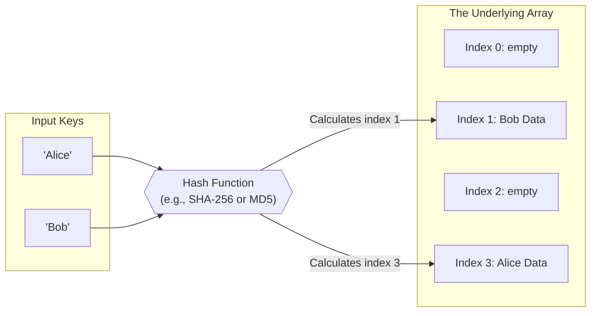

## Concept

In computer science, finding data in an Array takes $O(N)$ time because you have to check every slot. 
Finding data in a Binary Search Tree takes $O(\log N)$ time because you have to traverse down the branches.

A **Hash Table** allows you to find, insert, and delete data in mathematically pure, instant **$O(1)$ time**.

It achieves this by taking the data's "Key" (e.g., a username "Alice"), running it through a mathematical **Hash Function**, and generating a specific physical memory index (e.g., `42`). It then stores Alice's data directly at index 42. When you want to find Alice later, you don't have to search. You just run "Alice" through the hash function again, instantly get `42`, and look there.

## Mental Model

## The Hash Function

A good hash function must obey three rules:
1. **Deterministic:** Giving it "Alice" must *always* return `42`. If it randomly returned `43` the second time, you would lose your data.
2. **Fast:** It must execute in $O(1)$ time. If the hash function takes 5 seconds to calculate the number `42`, the data structure is useless.
3. **Uniform Distribution:** It should spread the data out evenly across the array. It shouldn't put everyone at index 1.

## Hash Collisions

Because the underlying array has a fixed physical size (e.g., 100 slots), and there are infinite possible string keys, **Hash Collisions are mathematically inevitable**. (This is called the Pigeonhole Principle).

A collision happens when two completely different keys (e.g., "Alice" and "Charlie") run through the hash function and accidentally generate the exact same index (`42`).

How do Hash Tables handle this?
Usually via **Separate Chaining**. Instead of storing the data directly in slot 42, slot 42 actually holds a *Linked List*. When Alice and Charlie both map to 42, the Hash Table just appends Charlie's data to the Linked List at slot 42.

## Interview Strategy

The Hash Table is the absolute most important data structure for technical interviews. **If you are ever stuck on a problem, your very first instinct should be: "Can I optimize this using a Hash Map?"**

- Have a nested $O(N^2)$ loop? A Hash Map reduces it to $O(N)$.
- Need to check if you've seen a number before? Use a Hash Set.
- Need to group anagrams together? Use a Hash Map.
- Need to count the frequency of characters? Use a Hash Map.

## Interview Questions

**Q: If a Hash Table handles collisions by putting items into a Linked List, what is the true worst-case time complexity of a Hash Table lookup?**
**A:** This is a classic "gotcha" question. 
The average-case lookup is **$O(1)$**. 
However, the theoretical absolute **worst-case lookup is $O(N)$**. 
If a malicious user realizes you are using a weak hash function, they can intentionally generate 10,000 specific strings that all mathematically collide at index `42`. The Hash Table degrades into a single massive Linked List of length 10,000. When you search for an item, the Hash Table instantly jumps to index `42` in $O(1)$ time, but then is forced to traverse the entire Linked List, taking $O(N)$ time.

**Q: A developer creates a JavaScript Hash Map using `const map = {}`. They try to use an object as a key: `map[{id: 1}] = "Alice"`. Then they do `map[{id: 2}] = "Bob"`. When they `console.log(map)`, it only has one entry! Why?**
**A:** Plain JavaScript objects (`{}`) strictly coerce all keys into Strings. 
When you pass the object `{id: 1}` as a key, JS calls `.toString()` on it, turning it into the literal string `"[object Object]"`. 
When you pass `{id: 2}`, it *also* turns into `"[object Object]"`. The second assignment simply overwrote the first one because they both resulted in the exact same string key!
To use objects as keys in JavaScript, you MUST use the modern `new Map()` class, which maps data using the actual physical memory reference of the object, not its stringified representation.
