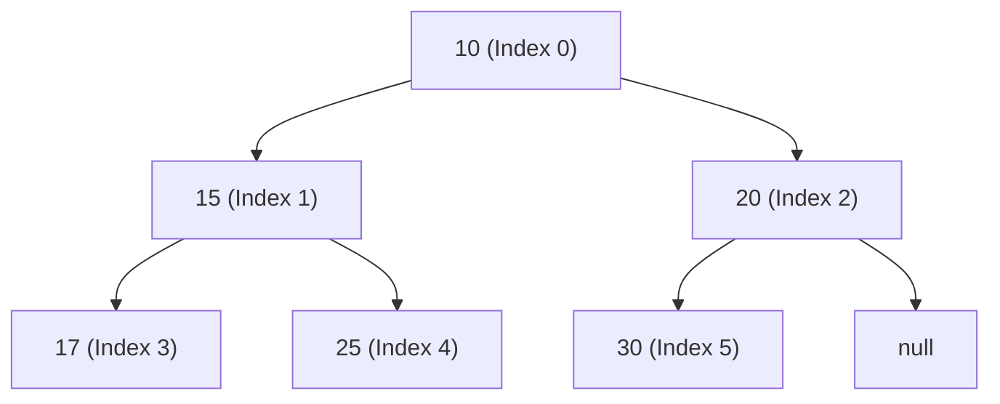

## Concept

If you want to repeatedly find the smallest (or largest) item in a dataset, a Hash Map is useless (it is unordered). 
You could use a sorted Array, but inserting a new item takes $O(N)$ time because you have to shift everything over to keep it sorted.

A **Heap** is a magical data structure that mathematically guarantees the absolute smallest (or largest) item is *always* sitting exactly at the top, available in instant **$O(1)$** time. 
Inserting a new item or deleting the top item takes a blazing-fast **$O(\log N)$** time.

## The Mathematical Rules

A Heap is physically implemented as an Array under the hood, but it represents a **Complete Binary Tree**.

1. **The Shape Property:** It must be a *Complete* Binary Tree. Every single level must be perfectly filled from left to right. There are no gaps.
2. **The Heap Property:** 
   - In a **Min-Heap**, every Parent node must be strictly LESS than or equal to its children. (The absolute smallest number bubbles up to the Root).
   - In a **Max-Heap**, every Parent node must be strictly GREATER than or equal to its children. (The absolute largest number bubbles up to the Root).

Crucially, **the siblings have no relationship to each other**. In a Min-Heap, the Left child could be `10` and the Right child could be `5`. The only rule is that their Parent must be smaller than both of them.

## The Array Representation (The Magic Math)

Because a Heap is a *Complete* Binary Tree (no gaps), we don't actually need to create `TreeNode` objects with `left` and `right` pointers. 
We can store the entire tree inside a flat, primitive **Array**!

If a Parent is sitting at index `i` in the array:
- Its **Left Child** is mathematically guaranteed to be at `(2 * i) + 1`.
- Its **Right Child** is mathematically guaranteed to be at `(2 * i) + 2`.
- Its **Parent** is mathematically guaranteed to be at `Math.floor((i - 1) / 2)`.

*(Note: Some implementations leave index 0 empty and start the root at index 1 to make the math even cleaner: `Left = 2i`, `Right = 2i + 1`, `Parent = i / 2`).*

## Mental Model

Array format: `[10, 15, 20, 17, 25, 30]`

Look at `15` (Index 1).
- Left Child: `(2 * 1) + 1 = 3`. Index 3 is `17`. Correct!
- Right Child: `(2 * 1) + 2 = 4`. Index 4 is `25`. Correct!

## Time Complexity

| Operation | Time Complexity | Explanation |
| :--- | :--- | :--- |
| **Get Min/Max** | $O(1)$ | It's always sitting right at index 0! |
| **Insert** | $O(\log N)$ | Push to the end of the array, then "Bubble Up" to restore order. |
| **Delete Min/Max** | $O(\log N)$ | Swap Root with the last item, pop the last item, then "Bubble Down" to restore order. |
| **Search** | $O(N)$ | A Heap is NOT a Binary Search Tree. To find a random number, you have to scan the whole array. |

## Interview Questions

**Q: In JavaScript/TypeScript, how do you import the standard library Heap?**
**A:** This is the most painful part of doing interviews in JavaScript: **JavaScript does NOT have a built-in Heap or Priority Queue.** 
If an interview problem requires a Heap, you must tell the interviewer: *"Because JS doesn't have a native Priority Queue, I'm going to assume I have access to a `MinPriorityQueue` class from a library, but I can implement the Heap algorithms from scratch if you'd like me to."* (Interviewers will almost always say "Yes, just assume you have the library, let's focus on the problem logic").

**Q: A developer needs to sort an array of 1 million random numbers. They decide to insert them all into a Min-Heap, and then repeatedly `pop()` the minimum value into a new array. What is the time complexity of this?**
**A:** This is the exact algorithm for **Heap Sort**. 
Inserting 1 item takes $O(\log N)$. Inserting $N$ items takes $O(N \log N)$ time.
Popping 1 item takes $O(\log N)$. Popping $N$ items takes $O(N \log N)$ time.
The overall time complexity is **$O(N \log N)$**, which is mathematically optimal for comparison-based sorting, rivaling Merge Sort and Quick Sort. However, in practice, Quick Sort is usually faster due to better CPU cache locality (Heap operations jump around the array wildly).
