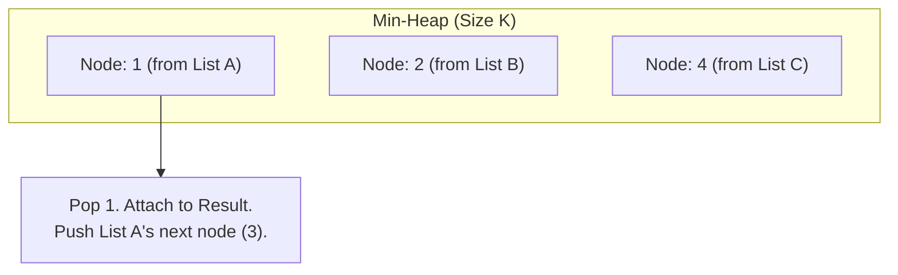

## Concept

LeetCode #23 (Hard).
*Problem: You are given an array of `k` linked-lists, each linked-list is sorted in ascending order. Merge all the linked-lists into one sorted linked-list and return it.*

This is a masterclass interview problem because it tests Linked Lists, Pointers, and Heaps simultaneously.

## Approach 1: Sequential Merging (The Bad Way)

We know how to merge two sorted lists (using the Two Pointer Dummy Node approach). 
Why not just merge List 1 and List 2. Then merge the result with List 3. Then merge with List 4...

**Why it's bad:** Imagine merging 100 lists of length 10.
- Merge L1 and L2 (Length 20).
- Merge L1/2 with L3 (Length 30).
- Merge L1/2/3 with L4 (Length 40).
You are traversing the exact same early nodes over and over again. The time complexity is $O(K^2 \times N)$.

## Approach 2: The Min-Heap (The Optimal Way)

At any given moment, the absolute smallest mathematical number must be at the `Head` of one of the `K` lists (because they are all individually sorted).

1. We take the `Head` pointer of all `K` lists, and dump them into a **Min-Heap**.
2. The Min-Heap instantly hands us the absolute smallest node out of all `K` lists.
3. We take that winning node, attach it to our final merged list, and advance its pointer to its `.next` child.
4. We push that new `.next` child back into the Min-Heap to compete!
5. Repeat until the Heap is empty.



## Implementation

```typescript
// N is the TOTAL number of nodes across all lists combined.
// K is the number of linked lists.
// Time Complexity: O(N log K)
// Space Complexity: O(K) (The heap only ever holds exactly 1 node from each list)

function mergeKLists(lists: Array<ListNode | null>): ListNode | null {
    // Note: The PQ needs to sort based on the Node's VALUE, but store the NODE itself.
    const minHeap = new MinPriorityQueue({ priority: (node: ListNode) => node.val });

    // 1. Throw the Head of every non-empty list into the Heap
    for (let listHead of lists) {
        if (listHead !== null) {
            minHeap.enqueue(listHead);
        }
    }

    const dummy = new ListNode(0);
    let current = dummy;

    // 2. Process the Heap
    while (!minHeap.isEmpty()) {
        // Get the absolute smallest node across all lists
        const smallestNode = minHeap.dequeue().element;
        
        // Attach it to our merged result
        current.next = smallestNode;
        current = current.next;

        // If this winning node has a child behind it, 
        // push the child into the Heap to compete in the next round!
        if (smallestNode.next !== null) {
            minHeap.enqueue(smallestNode.next);
        }
    }

    return dummy.next;
}
```

## Approach 3: Divide and Conquer (Merge Sort Style)

If the interviewer explicitly bans you from using a Priority Queue, you can achieve the exact same $O(N \log K)$ time complexity using **Divide and Conquer**.

Instead of merging L1 with L2, and then with L3...
You merge L1 with L2. You merge L3 with L4. You merge L5 with L6.
Then you merge the L1/2 block with the L3/4 block.
By pairing them off like a tournament bracket, you halve the number of lists at each step, preventing the massive repeated traversals. This takes $O(\log K)$ levels of merging, resulting in $O(N \log K)$ time.

## Interview Questions

**Q: In the Min-Heap solution, what is the Maximum Size the Heap can ever reach?**
**A:** The Heap will never exceed size **$K$** (where K is the number of linked lists). We initialize it with the K heads. Every time we `dequeue` exactly 1 node, we `enqueue` at most exactly 1 node. The heap stays strictly constrained to $O(K)$ space, making it incredibly memory efficient even if the linked lists are millions of nodes long.

**Q: Is "Merge K Sorted Lists" used in the real world?**
**A:** Yes, it is the fundamental algorithm powering **External Sort** in distributed databases. If a database needs to sort a 100-Gigabyte table, it cannot fit it into 16GB of RAM. It chunks the table into 16GB blocks, sorts them individually, and saves them to disk. Now you have $K$ sorted files on disk. The database streams the first row of each file into an in-memory Min-Heap (Merge K Sorted Lists), writing the winner to the final output file. This allows massive datasets to be perfectly sorted with minimal RAM usage.
