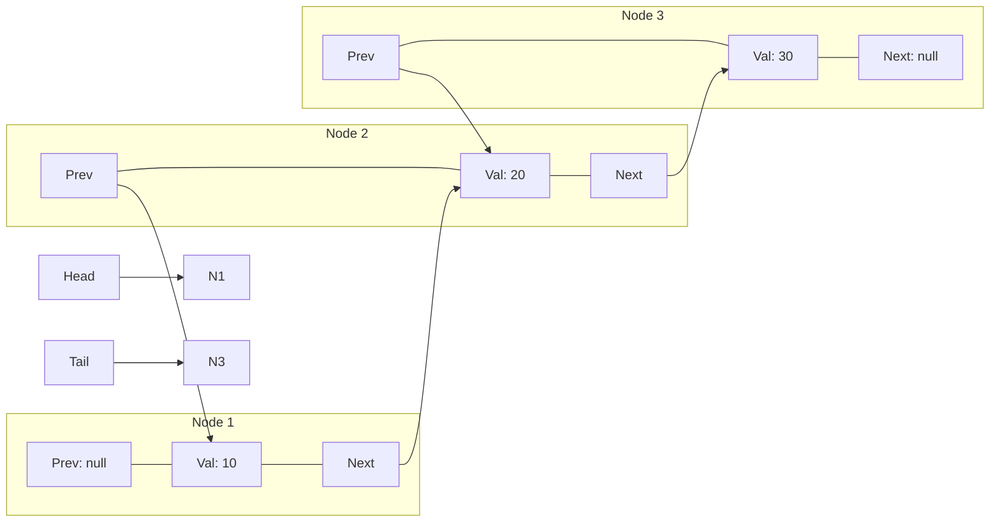

## Concept

A Singly Linked List has one fatal flaw: it is a one-way street.
If you are at Node 5, and you suddenly realize you need to check something on Node 4, you cannot step backward. You are forced to start all the way back at the Head and traverse forward 4 steps.

A **Doubly Linked List** fixes this by adding a second pointer to every node:
1. `val`: The data.
2. `next`: Pointer to the next node.
3. `prev`: Pointer to the **previous** node.

## Mental Model


*(Notice how the Head has a `prev` of null, and the Tail has a `next` of null).*

## The Trade-Off

- **Pros:** You can traverse in both directions. If you explicitly keep a `Tail` pointer, you can Insert/Delete at the absolute end of the list in $O(1)$ time (which takes $O(N)$ time in a Singly Linked List).
- **Cons:** **Memory Overhead.** Every single node now requires an extra 64-bit pointer. If you have 10 million nodes, you are consuming significantly more RAM. Also, every Insert/Delete operation now requires rewiring 4 pointers instead of 2, making the code more complex and bug-prone.

## Implementation

```typescript
class DoubleListNode {
    val: number;
    next: DoubleListNode | null;
    prev: DoubleListNode | null;
    
    constructor(val: number) {
        this.val = val;
        this.next = null;
        this.prev = null;
    }
}

class DoublyLinkedList {
    head: DoubleListNode | null = null;
    tail: DoubleListNode | null = null;

    // O(1) Insertion at the tail!
    append(val: number): void {
        const newNode = new DoubleListNode(val);
        
        if (this.tail === null) {
            // First item in the list
            this.head = newNode;
            this.tail = newNode;
        } else {
            // Link backwards
            newNode.prev = this.tail;
            // Link forwards
            this.tail.next = newNode;
            // Move tail
            this.tail = newNode;
        }
    }
}
```

## Browser History Example

The textbook real-world use case for a Doubly Linked List is the **Back/Forward button in a Web Browser**.

1. You visit Google (`Node 1`).
2. You click a link to YouTube (`Node 2`). `Node 1.next = Node 2`. `Node 2.prev = Node 1`.
3. You click a link to an Article (`Node 3`).
4. You click the "Back" button. The browser simply looks at `current.prev` and instantly loads YouTube in $O(1)$ time. 
5. You click the "Forward" button. The browser looks at `current.next` and instantly loads the Article.

## Interview Questions

**Q: A developer implements an LRU (Least Recently Used) Cache. They use a Hash Map to store the keys, and a basic Array to track the "recent usage" history. When the cache gets full, they use `.shift()` to remove the oldest item from the Array. Why is this a terrible design, and how does a Doubly Linked List fix it?**
**A:** Calling `.shift()` on an Array is an $O(N)$ operation. In a high-traffic database cache (like Redis), doing an $O(N)$ operation every time a new item is added will paralyze the CPU.
The mathematically perfect data structure for an LRU Cache is a combination of a **Hash Map + Doubly Linked List**.
When an item is accessed, you use the Hash Map to find the Node in $O(1)$ time. Because it is a Doubly Linked List, you can sever the Node from the middle of the list ($O(1)$ pointer rewiring) and append it to the Tail ($O(1)$) to mark it as recently used. When the cache is full, you simply sever the Head node ($O(1)$) to evict the oldest item. This achieves $O(1)$ time complexity for every single operation.
