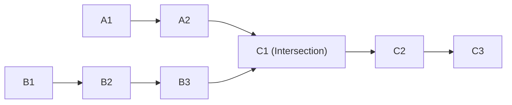

## Concept

*Problem: Given the heads of two singly linked-lists `headA` and `headB`, return the node at which the two lists intersect. If the two linked lists have no intersection at all, return `null`.*


*(Notice that List A is shorter than List B before they merge).*

**Crucial detail:** We are looking for an intersection by **Memory Reference**, not by value. If List A has a node with value `5`, and List B has a different node with value `5`, that is not an intersection. The `next` pointers must physically point to the exact same object in RAM.

## Approach 1: The Hash Set (O(N) Space)

The easiest way is to traverse List A completely, throwing every Node's memory reference into a Hash Set.
Then, traverse List B. The first time you encounter a Node that already exists in the Set, you have found the intersection!

This takes $O(A + B)$ time, but unfortunately takes $O(A)$ extra space.

## Approach 2: The Two Pointer Alignment (O(1) Space)

Why can't we just use two pointers and walk them forward simultaneously?
Because the lists are different lengths! By the time Pointer A hits the intersection, Pointer B is still lagging behind. They won't hit it at the exact same time.

**The Math Trick:**
We must chop off the "extra length" of the longer list, so they both start at the exact same distance from the intersection.

1. Find the length of List A (e.g., 5).
2. Find the length of List B (e.g., 6).
3. The difference is 1. Move Pointer B forward exactly 1 step.
4. Now, both pointers are exactly 5 steps away from the end. Move them both forward 1 step at a time. They will collide exactly at the intersection!

```typescript
function getIntersectionNode(headA: ListNode | null, headB: ListNode | null): ListNode | null {
    // 1. Get lengths
    let lenA = getLength(headA);
    let lenB = getLength(headB);

    let currA = headA;
    let currB = headB;

    // 2. Align the pointers
    while (lenA > lenB) {
        currA = currA!.next;
        lenA--;
    }
    while (lenB > lenA) {
        currB = currB!.next;
        lenB--;
    }

    // 3. March forward together
    while (currA !== currB) {
        currA = currA!.next;
        currB = currB!.next;
    }

    // They collided! (Or they both hit null, which is correct if no intersection)
    return currA;
}

function getLength(head: ListNode | null): number {
    let count = 0;
    while (head) {
        count++;
        head = head.next;
    }
    return count;
}
```

## The "Romance" Hack (The Ultimate Trick)

There is a legendary, mind-bending hack to align the pointers without calculating the lengths.

If Pointer A walks List A, and Pointer B walks List B, they finish at different times. 
But if Pointer A finishes List A, and instantly teleports to the start of List B... 
And Pointer B finishes List B, and instantly teleports to the start of List A...
**They will both have walked the exact same total distance (`Length A + Length B`).** Because they walk the exact same total distance, the length difference cancels out, and they are mathematically guaranteed to collide perfectly at the intersection on their second lap!

```typescript
function getIntersectionNodeMagic(headA: ListNode | null, headB: ListNode | null): ListNode | null {
    let pointerA = headA;
    let pointerB = headB;

    // Loop until they collide
    while (pointerA !== pointerB) {
        // If A hits the end, teleport to B. Otherwise, step.
        pointerA = (pointerA === null) ? headB : pointerA.next;
        // If B hits the end, teleport to A. Otherwise, step.
        pointerB = (pointerB === null) ? headA : pointerB.next;
    }

    return pointerA;
}
```

## Interview Questions

**Q: In the "Magic" approach, what happens if there is NO intersection at all? Will it loop infinitely?**
**A:** No, it will not infinite loop.
If there is no intersection, Pointer A walks List A + List B. Pointer B walks List B + List A. 
They have walked the exact same distance. Because they never intersected, they will both physically step off the very last node and become `null` at the exact same millisecond. The `while (pointerA !== pointerB)` loop will evaluate `while (null !== null)` which is false. The loop breaks, and it safely returns `null`!
