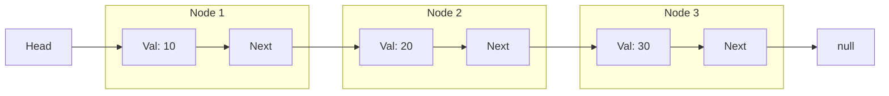

## Concept

In an Array, memory is allocated as one massive, continuous physical block. This makes lookups $O(1)$ fast, but makes resizing and inserting elements very slow.

A **Linked List** is a dynamic data structure where the data is stored in discrete, separate objects called **Nodes**. 
These Nodes are scattered randomly across the computer's RAM. To keep them organized, every Node contains two things:
1. `value`: The actual data.
2. `next`: A physical pointer (memory address) to the exact location of the next Node.

The first node is called the **Head**. The last node's `next` pointer points to `null`.

## Mental Model



## Time Complexity

| Operation | Array | Linked List | Explanation |
| :--- | :--- | :--- | :--- |
| **Read (Access)** | $O(1)$ | $O(N)$ | You must start at the Head and follow the pointers one by one to find the Nth item. |
| **Search** | $O(N)$ | $O(N)$ | Check every item. |
| **Insert/Delete (Start)** | $O(N)$ | $O(1)$ | Just create a new Node and point its `next` to the old Head. No shifting required! |
| **Insert/Delete (Middle)** | $O(N)$ | $O(N)$ | You have to traverse ($O(N)$) to find the spot, but the actual insertion takes $O(1)$ time by just rewiring two pointers. |

## Implementation

```typescript
class ListNode {
    val: number;
    next: ListNode | null;
    
    constructor(val?: number, next?: ListNode | null) {
        this.val = (val === undefined ? 0 : val);
        this.next = (next === undefined ? null : next);
    }
}

class SinglyLinkedList {
    head: ListNode | null = null;

    // O(1) Insertion at the front
    prepend(val: number): void {
        const newNode = new ListNode(val);
        newNode.next = this.head;
        this.head = newNode;
    }

    // O(N) Traversal to print values
    print(): void {
        let current = this.head;
        while (current !== null) {
            console.log(current.val);
            current = current.next;
        }
    }
}
```

## The Dummy Node Pattern

The most common source of bugs in Linked List interview questions is handling the "Edge Cases" (inserting into an empty list, or deleting the very first Head node).

To bypass all of these edge cases, professionals use a **Dummy Node** (or Sentinel Node).
You create a fake node (`new ListNode(0)`) and point it at the real Head. You do all your algorithmic manipulation, and at the very end, you just return `dummy.next`. This mathematically guarantees you never accidentally point to a `null` Head during your loops.

```typescript
function deleteNode(head: ListNode | null, val: number): ListNode | null {
    // 1. Create a dummy node pointing to the head
    const dummy = new ListNode(0);
    dummy.next = head;
    
    let current = dummy;
    
    // 2. Traverse looking one step ahead
    while (current.next !== null) {
        if (current.next.val === val) {
            // Found it! Rewire the pointer to skip the bad node
            current.next = current.next.next;
            break; 
        }
        current = current.next;
    }
    
    // 3. Safely return the real head
    return dummy.next;
}
```

## Interview Questions

**Q: A developer needs a data structure to store a list of 100,000 user IDs. They frequently need to look up random user IDs by index. Should they use an Array or a Linked List?**
**A:** They must use an **Array**. 
Looking up data by index in an Array is instantaneous ($O(1)$) because the CPU just calculates the physical memory offset.
Looking up the 50,000th item in a Linked List requires starting at the Head and following 50,000 individual memory pointers sequentially ($O(N)$), which is horribly slow for random access. 
You only use Linked Lists when you have massive amounts of *Insertions and Deletions at the edges*, and rarely do random reads.

**Q: In JavaScript/TypeScript, when you delete a node by rewiring `current.next = current.next.next`, what happens to the physical node you skipped over?**
**A:** In unmanaged languages like C, you would have a Memory Leak unless you explicitly called `free()` on the skipped node.
In JavaScript, the **Garbage Collector** handles it. Once a node is completely disconnected from the active graph (no other variables or `next` pointers are pointing to it), the Javascript engine detects that it is "unreachable". Periodically, the Garbage Collector wakes up, sweeps the RAM, and automatically reclaims the memory occupied by the orphaned node.
