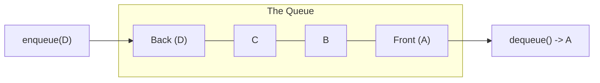

## Concept

A **Queue** is a linear data structure that follows the **FIFO** (First In, First Out) principle.

Think of a physical line of people waiting to buy movie tickets. 
When a new person arrives, they join the *back* of the line (Enqueue). The ticket seller serves the person at the very *front* of the line (Dequeue). 
Nobody is allowed to cut the line.

## Mental Model



## Core Operations

Like a Stack, a Queue strictly enforces $O(1)$ time complexity for its operations:
- `enqueue(item)`: Add an item to the back. ($O(1)$)
- `dequeue()`: Remove and return the front item. ($O(1)$)
- `peek()` / `front()`: Return the front item without removing it. ($O(1)$)
- `isEmpty()`: Check if the queue has no items. ($O(1)$)

## The Array Trap

In JavaScript, developers often try to implement a Queue using a standard Array:
```typescript
const badQueue = [];
badQueue.push("A"); // Enqueue: O(1)
badQueue.shift();   // Dequeue: O(N) !! DANGER !!
```
Calling `array.shift()` is an $O(N)$ operation because the CPU has to physically move every remaining item in the array one slot to the left to close the gap. **Using `.shift()` for a Queue in an interview is an immediate red flag that will fail your code.**

## Implementation (Linked List)

To achieve true $O(1)$ `dequeue`, a Queue must be implemented using a **Singly Linked List** that maintains both a `Head` pointer and a `Tail` pointer.
- You enqueue by attaching to the `Tail`.
- You dequeue by severing the `Head`.

```typescript
class Node<T> {
    val: T;
    next: Node<T> | null = null;
    constructor(val: T) { this.val = val; }
}

class Queue<T> {
    private head: Node<T> | null = null;
    private tail: Node<T> | null = null;
    public size: number = 0;

    // O(1) Time
    enqueue(val: T): void {
        const newNode = new Node(val);
        if (this.tail === null) {
            this.head = newNode;
            this.tail = newNode;
        } else {
            this.tail.next = newNode;
            this.tail = newNode;
        }
        this.size++;
    }

    // O(1) Time
    dequeue(): T | undefined {
        if (this.head === null) return undefined;
        
        const val = this.head.val;
        this.head = this.head.next;
        
        // If we dequeued the absolute last item, reset tail to null!
        if (this.head === null) {
            this.tail = null;
        }
        
        this.size--;
        return val;
    }
}
```

## Use Cases

Queues are used whenever you need to process things in the exact order they arrived (Fairness), or when you need to process data level-by-level.

1. **Breadth-First Search (BFS):** The absolute most important use case for interviews. When exploring a Graph or Tree level-by-level, you push the children into a Queue.
2. **Task Scheduling:** The JavaScript Event Loop acts as a massive Queue. Promises and setTimeout callbacks are placed in the Macrotask/Microtask Queues to be executed in order.
3. **Rate Limiting:** Sliding Window logs for API rate limiters are often implemented using Queues.

## Interview Questions

**Q: A developer in Python uses `list.pop(0)` to dequeue an item. Is this optimal?**
**A:** No. Just like JavaScript's `.shift()`, Python's `pop(0)` on a standard list is an $O(N)$ operation. Python developers should explicitly import and use `collections.deque`, which is implemented as a doubly linked list under the hood, allowing true $O(1)$ pop from the front.

**Q: You are asked to implement a "Circular Queue" using a fixed-size Array. How do you do it in $O(1)$ time without shifting elements?**
**A:** You use the **Modulo Arithmetic** trick. 
You allocate a fixed array (e.g., size 5). You maintain a `Head` index and a `Tail` index, both starting at 0. 
When you enqueue, you place the item at `array[Tail]` and move Tail forward: `Tail = (Tail + 1) % 5`.
When you dequeue, you read `array[Head]` and move Head forward: `Head = (Head + 1) % 5`.
The modulo operator ensures that when the pointers hit the end of the array, they loop seamlessly back around to index 0, reusing the empty physical space left behind by previous dequeues.
