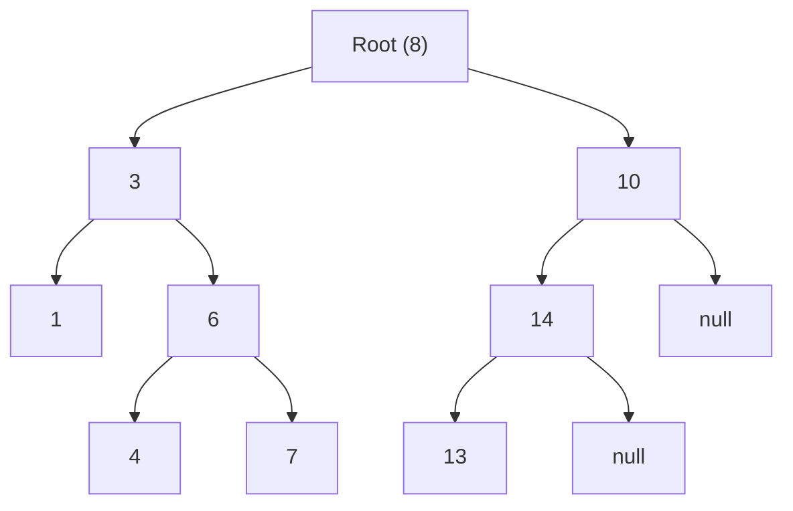

## Concept

A **Binary Search Tree (BST)** is a normal Binary Tree that enforces one strict mathematical rule across every single node:

1. Everything in the **Left Branch** must be strictly LESS than the node's value.
2. Everything in the **Right Branch** must be strictly GREATER than the node's value.

This rule organizes the data, allowing the tree to execute ultra-fast $O(\log N)$ searches, identical to how a real-world dictionary works.

## Mental Model



Imagine searching for the number `7`.
1. Start at Root (`8`). Is 7 less than 8? Yes. Go Left. *(We just instantly eliminated half the entire tree!)*
2. Current node (`3`). Is 7 greater than 3? Yes. Go Right.
3. Current node (`6`). Is 7 greater than 6? Yes. Go Right.
4. Current node (`7`). Found it!

## Time Complexity

| Operation | Average Case | Worst Case (Degenerate Tree) |
| :--- | :--- | :--- |
| **Search** | $O(\log N)$ | $O(N)$ |
| **Insert** | $O(\log N)$ | $O(N)$ |
| **Delete** | $O(\log N)$ | $O(N)$ |

**The Worst Case Trap:**
If you insert data that is *already sorted* into a naive BST (`1, 2, 3, 4, 5`), the 2 goes to the right of 1. The 3 goes to the right of 2. 
You end up creating a completely straight line. The tree loses its branching power and degrades into a Singly Linked List, causing the Time Complexity to plummet to $O(N)$.

## Validate a BST

*Problem: Given the root of a binary tree, determine if it is a valid binary search tree.*

**The Beginner Mistake:**
A junior developer will just check `if (node.left.val < node.val && node.right.val > node.val)`. 
This is completely wrong! That only checks the *immediate children*. 
If the Root is `5`, its left child could be `3`, but `3`'s right child could be `99`. The number `99` would be sitting on the left side of the Root (`5`), completely violating the global BST rule.

**The Correct Approach (Min/Max Boundaries):**
You must pass a `min` and `max` boundary down the recursion. As you travel Left, you update the `max` boundary. As you travel Right, you update the `min` boundary. Every node must strictly fall between its inherited boundaries.

```typescript
function isValidBST(root: TreeNode | null): boolean {
    function dfs(node: TreeNode | null, min: number, max: number): boolean {
        // Base case: An empty tree is mathematically valid
        if (node === null) return true;

        // Does it break the global boundary rules?
        if (node.val <= min || node.val >= max) {
            return false;
        }

        // Check the left branch (must be strictly LESS than the current node's value)
        const isLeftValid = dfs(node.left, min, node.val);
        // Check the right branch (must be strictly GREATER than the current node's value)
        const isRightValid = dfs(node.right, node.val, max);

        return isLeftValid && isRightValid;
    }

    // Initialize with absolute Infinity boundaries
    return dfs(root, -Infinity, Infinity);
}
```

## Interview Questions

**Q: A developer claims you can validate a BST without using the Min/Max boundary recursion. Is this true?**
**A:** Yes, the alternative approach is the **In-order Traversal**. 
Because an In-order traversal (`Left -> Node -> Right`) of a valid BST is mathematically guaranteed to output an array that is strictly sorted in ascending order, you just run the traversal. If you ever encounter a node whose value is smaller than or equal to the *previously* processed node, you instantly know the tree is an invalid BST.

**Q: If a standard BST can degrade into an $O(N)$ Linked List, how do databases use trees without crashing?**
**A:** Standard databases do not use naive BSTs. They use **Self-Balancing Trees** (like AVL Trees, Red-Black Trees, or B-Trees). 
A self-balancing tree runs an algorithmic check every time a new node is inserted. If it detects that the tree is becoming lopsided, it physically "rotates" the nodes around the root to force the tree back into a bushy, perfectly balanced shape. This mathematically guarantees the height never exceeds $\log N$, keeping the database running at peak efficiency regardless of the insertion order.
