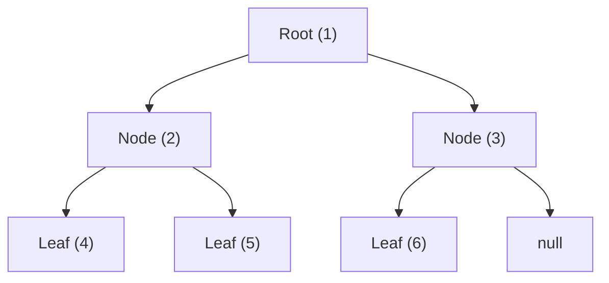

## Concept

Arrays and Linked Lists are **linear** data structures. There is only one logical path forward.
A **Tree** is a **hierarchical** (non-linear) data structure. It starts at a single `Root` node, and branches downwards into multiple sub-nodes (Children).

A **Binary Tree** is a specific type of tree with one strict rule: **Every node can have at most TWO children (Left and Right).**

Trees perfectly model real-world hierarchies like the DOM (Document Object Model), file systems on your hard drive, and organizational charts.

## Mental Model & Terminology



- **Root:** The absolute topmost node (`1`).
- **Parent:** A node that has branches underneath it (e.g., `2` is the parent of `4` and `5`).
- **Child:** A node directly connected below a parent.
- **Leaf:** A node with ZERO children (`4`, `5`, `6`). It is the end of the line.
- **Depth / Level:** The distance from the Root to a specific node. (Root is Level 0).
- **Height:** The longest path from the Root to the deepest Leaf.

## Implementation

Under the hood, a Binary Tree is identical to a Doubly Linked List, but instead of the pointers going `next` and `prev`, they go `left` and `right`.

```typescript
class TreeNode {
    val: number;
    left: TreeNode | null;
    right: TreeNode | null;
    
    constructor(val?: number, left?: TreeNode | null, right?: TreeNode | null) {
        this.val = (val === undefined ? 0 : val);
        this.left = (left === undefined ? null : left);
        this.right = (right === undefined ? null : right);
    }
}
```

## The Recursive Nature of Trees

Because every node in a tree has a left child and a right child, **every single node can be viewed as the "Root" of its own miniature sub-tree.**

This recursive mathematical property makes **Recursion** the absolute best way to interact with Trees. If you try to traverse a tree using `while` loops, it is incredibly difficult because you have to manually track branching paths. With Recursion, you just write the logic for *one single node*, and the Call Stack magically handles all the branching for you.

```typescript
// Example: Find the sum of all nodes in a Binary Tree
function sumTree(root: TreeNode | null): number {
    // Base Case: If we hit an empty node, it contributes 0 to the sum.
    if (root === null) return 0;
    
    // Recursive Step: My value + the sum of my left branch + the sum of my right branch
    return root.val + sumTree(root.left) + sumTree(root.right);
}
```

## Interview Questions

**Q: What is the difference between a "Full" Binary Tree and a "Complete" Binary Tree?**
**A:** 
- A **Full** Binary Tree means every node has either exactly 0 children or exactly 2 children. (No node is a single parent).
- A **Complete** Binary Tree means every single level of the tree is perfectly filled, *except possibly the very last level*, which must be filled strictly from left to right without any gaps. (Complete Binary Trees are the mathematical foundation of the **Heap** data structure).

**Q: A developer creates a Binary Tree where every single right child is `null`, and all data is in a straight line down the left side. What is the time complexity of searching this tree?**
**A:** This is a degenerate (unbalanced) tree. Because it is essentially just a straight line, it has physically degraded into a Singly Linked List. Therefore, searching it takes **$O(N)$** time. This is why "Self-Balancing" trees (like AVL or Red-Black Trees) were invented—to forcibly rotate the nodes to keep the tree bushy, guaranteeing an $O(\log N)$ search time.
