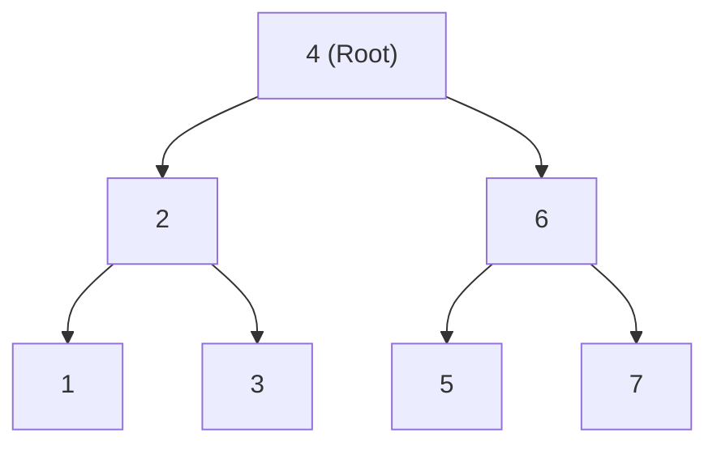

## Concept

In **In-order Traversal**, the current node is processed *in between* its children.
**Order:** `Left Child` $\rightarrow$ `Node` $\rightarrow$ `Right Child`.

This is the most important DFS traversal for interviews because of one magical property:
**When you run an In-order Traversal on a Binary Search Tree (BST), the resulting output array is perfectly sorted in ascending order.**

## Mental Model



**Execution Path:**
1. Start at `4`. Go Left to `2`. Go Left to `1`.
2. `1` has no left child. Process `1`.
3. Backtrack to `2`. Process `2`.
4. Go Right to `3`. Process `3`.
5. Backtrack to `4`. Process `4`.
6. Go Right to `6`. Go Left to `5`. Process `5`.
7. Backtrack to `6`. Process `6`.
8. Go Right to `7`. Process `7`.

**Final Output Array:** `[1, 2, 3, 4, 5, 6, 7]` *(Notice how it is perfectly sorted!)*

## Implementation (Recursive)

```typescript
function inorderTraversal(root: TreeNode | null): number[] {
    const result: number[] = [];
    
    function dfs(node: TreeNode | null) {
        if (node === null) return;
        
        dfs(node.left);          // 1. Plunge all the way Left
        result.push(node.val);   // 2. Process Node
        dfs(node.right);         // 3. Then go Right
    }
    
    dfs(root);
    return result;
}
```

## Implementation (Iterative)

Writing In-order iteratively is much trickier than Pre-order. You cannot just blindly pop the stack, because you must plunge all the way down the left side before you are allowed to process anything.

```typescript
function inorderTraversalIterative(root: TreeNode | null): number[] {
    const result: number[] = [];
    const stack: TreeNode[] = [];
    let current = root;
    
    while (current !== null || stack.length > 0) {
        // 1. Plunge down the rabbit hole to the absolute bottom left
        while (current !== null) {
            stack.push(current);
            current = current.left;
        }
        
        // 2. We hit the bottom. Pop the node and process it.
        current = stack.pop()!;
        result.push(current.val);
        
        // 3. Pivot to the right branch (if it exists, the outer loop will plunge down its left side!)
        current = current.right;
    }
    
    return result;
}
```

## Interview Questions

**Q: A problem asks you to find the "Kth Smallest Element in a BST". Do you need to traverse the entire tree?**
**A:** No! Because an In-order traversal of a BST guarantees the numbers are visited in sorted ascending order, you just run an In-order traversal and maintain a `count` variable. The moment `count === K`, you have found the exact answer. You can immediately return and abort the traversal early, saving massive amounts of time ($O(H + K)$ time complexity, instead of $O(N)$).

**Q: How do you validate if a Binary Tree is a valid Binary Search Tree (BST)?**
**A:** The easiest trick is to run an In-order traversal. As you traverse, you simply check if the current node's value is strictly greater than the *previously processed* node's value. If you ever process a node that is smaller than the previous one, the sorted order is broken, and it is instantly proven to be an invalid BST.
