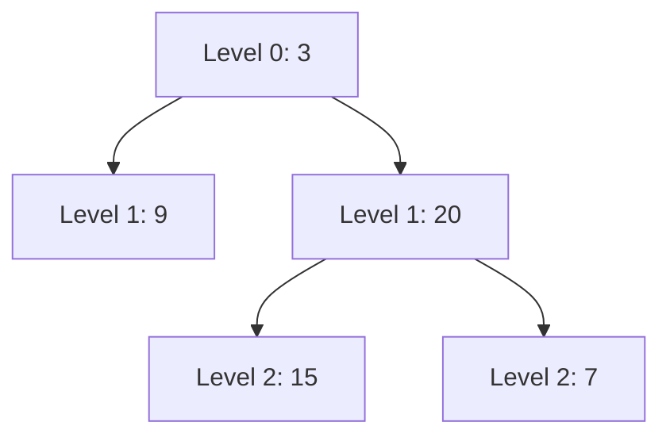

## Concept

A **Level Order Traversal** executes a Breadth-First Search (BFS). 
Instead of plunging deep down a single branch, it systematically scans the tree horizontally, completing Level 0, then Level 1, then Level 2.

Because Recursion fundamentally relies on plunging deep down the Call Stack, you cannot easily use Recursion for BFS. You must use an iterative `while` loop paired with a **Queue**.

## Mental Model



**Output format required by LeetCode:** `[[3], [9, 20], [15, 7]]`

**Queue Execution:**
1. Enqueue the Root `[3]`.
2. Dequeue `3`. Push its children (`9, 20`) to the Queue. Queue is now `[9, 20]`.
3. Dequeue `9`. It has no children. Queue is `[20]`.
4. Dequeue `20`. Push its children (`15, 7`). Queue is `[15, 7]`.
5. etc...

## Implementation

The trick to returning the array grouped by levels (`[[3], [9, 20]]`) instead of just a flat array (`[3, 9, 20]`) is the **Inner Loop Size Snapshot**.

At the start of the `while` loop, the Queue holds exactly all the nodes for the current level. If we take a snapshot of `queue.length` (e.g., 2), we can run an inner `for` loop exactly 2 times. This guarantees we only process the current level's nodes, while allowing their children to safely queue up at the back for the *next* level.

```typescript
// Time Complexity: O(N)
// Space Complexity: O(N) (The bottom level of a tree holds ~N/2 nodes in the Queue)
function levelOrder(root: TreeNode | null): number[][] {
    if (root === null) return [];
    
    const result: number[][] = [];
    const queue: TreeNode[] = [root]; // Queue initialization
    
    while (queue.length > 0) {
        // Snapshot the exact number of nodes on this level
        const levelSize = queue.length;
        const currentLevelArr: number[] = [];
        
        // Process ONLY the nodes on this level
        for (let i = 0; i < levelSize; i++) {
            // In a real interview, mention you'd use a real Queue for O(1) shift
            const node = queue.shift()!; 
            
            currentLevelArr.push(node.val);
            
            // Queue up the children for the NEXT level
            if (node.left !== null) queue.push(node.left);
            if (node.right !== null) queue.push(node.right);
        }
        
        result.push(currentLevelArr);
    }
    
    return result;
}
```

## Interview Questions

**Q: A problem asks for the "Right Side View of a Binary Tree" (imagine standing on the right side of the tree and looking at it—what nodes do you see?). How does BFS solve this?**
**A:** The right side view is simply the **very last node in every level**. 
Using the standard Level Order Traversal template, inside the `for` loop, you just check `if (i === levelSize - 1)`. If it is the last iteration of the inner loop, you know this node is the right-most node on the current level, and you push its value to your final answer array.

**Q: Could you use DFS to solve the "Right Side View" instead of BFS?**
**A:** Yes! You can use an altered Pre-order traversal where you prioritize the Right child (`Node -> Right -> Left`). You pass a `depth` variable down the recursion. If `depth === result.length`, it means this is the *first* time your recursion has plunged into this specific depth. Because you prioritized the Right branch, the first node you discover at any depth is mathematically guaranteed to be the right-most node! This is a brilliant optimization that saves the $O(N)$ space required by the BFS Queue.
