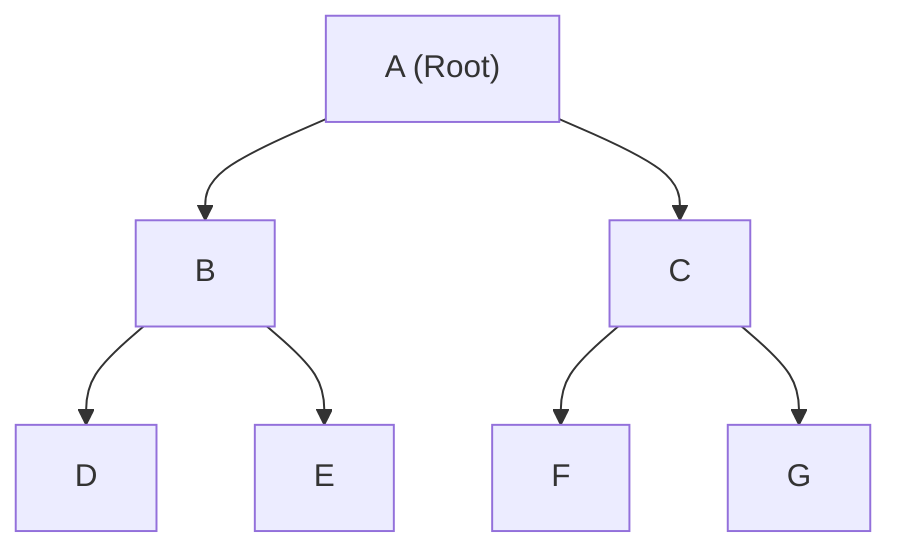

## Concept

In **Post-order Traversal**, the current node is processed *after* both of its children have been fully processed.
**Order:** `Left Child` $\rightarrow$ `Right Child` $\rightarrow$ `Node`.

You use Post-order when you are executing a **"Bottom-Up"** algorithm. 
If a Parent node mathematically requires the calculated answers from its Left and Right children before it can calculate its own answer, you MUST use Post-order traversal.

## Mental Model



**Execution Path:**
1. Plunge Left. `D` has no children. Process `D`.
2. Plunge Right. `E` has no children. Process `E`.
3. Now that both children are done, process the Parent. Process `B`.
4. Go to the right side of the tree. Process `F`.
5. Process `G`.
6. Process the Parent. Process `C`.
7. Finally, process the absolute Root. Process `A`.

**Final Output Array:** `[D, E, B, F, G, C, A]`

## Implementation (Recursive)

```typescript
function postorderTraversal(root: TreeNode | null): number[] {
    const result: number[] = [];
    
    function dfs(node: TreeNode | null) {
        if (node === null) return;
        
        dfs(node.left);          // 1. Plunge Left
        dfs(node.right);         // 2. Plunge Right
        result.push(node.val);   // 3. Process Node (Bottom-Up)
    }
    
    dfs(root);
    return result;
}
```

## The "Bottom-Up" Pattern (Max Depth)

The absolute best way to understand why Post-order is so powerful is the problem **"Maximum Depth of a Binary Tree"**.

To find the max depth, a Parent node thinks: *"I don't know how deep I am. But if I ask my Left child how deep it is, and my Right child how deep it is, I just take the bigger number and add 1 (for myself)!"*

This requires the Parent to wait for the children to return their answers.

```typescript
function maxDepth(root: TreeNode | null): number {
    // Base Case: An empty node has a depth of 0
    if (root === null) return 0;
    
    // 1. Plunge Left
    const leftDepth = maxDepth(root.left);
    // 2. Plunge Right
    const rightDepth = maxDepth(root.right);
    
    // 3. Process Node (Bottom-Up Math)
    return Math.max(leftDepth, rightDepth) + 1;
}
```

## Interview Questions

**Q: A problem asks you to entirely delete a Binary Tree from memory (in C or C++). Which traversal must you use?**
**A:** You must use **Post-order Traversal**. 
If you used Pre-order, you would delete the Parent node first. The moment you delete the Parent, you destroy the physical memory pointers to the Left and Right children, creating massive memory leaks because the children are now orphaned and unreachable. 
By using Post-order, you guarantee that you safely `free()` the Left child, then `free()` the Right child, and only *then* `free()` the Parent.

**Q: In the "Lowest Common Ancestor" (LCA) problem, why is Post-order the most efficient approach?**
**A:** Because LCA is fundamentally a Bottom-Up question. We are looking for a node that has target `p` in its left branch and target `q` in its right branch.
By using Post-order, the recursion plunges to the bottom of the tree. When it hits a target, it bubbles a `true` signal upwards. When a Parent node receives a `true` signal from its Left child AND a `true` signal from its Right child simultaneously, it instantly knows "I am the exact junction point. I am the Lowest Common Ancestor."
