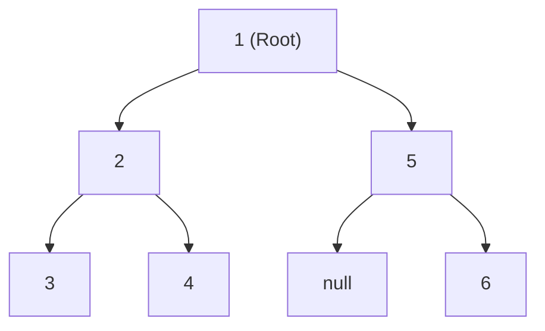

## Concept

In **Pre-order Traversal**, the current node is processed *before* moving on to its children.
**Order:** `Node` $\rightarrow$ `Left Child` $\rightarrow$ `Right Child`.

You use Pre-order when you are doing a **"Top-Down"** operation. For example, if you want to make an exact clone of a tree, you must create the Parent node *first* before you can attach the children to it.

## Mental Model



**Execution Path:**
1. Process `1` (Root).
2. Go Left. Process `2`.
3. Go Left. Process `3`.
4. `3` has no children. Backtrack to `2`.
5. Go Right. Process `4`.
6. Backtrack to `1`.
7. Go Right. Process `5`.
8. `5` has no left child. Go Right. Process `6`.

**Final Output Array:** `[1, 2, 3, 4, 5, 6]`

## Implementation (Recursive)

The recursive implementation is trivial. The order of the function calls dictates the traversal type.

```typescript
function preorderTraversal(root: TreeNode | null): number[] {
    const result: number[] = [];
    
    function dfs(node: TreeNode | null) {
        if (node === null) return;
        
        result.push(node.val);   // 1. Process Node FIRST
        dfs(node.left);          // 2. Then go Left
        dfs(node.right);         // 3. Then go Right
    }
    
    dfs(root);
    return result;
}
```

## Implementation (Iterative)

In advanced interviews, you may be asked to implement DFS *without* using recursion (to prove you understand how the Call Stack works). You must use a manual **Stack** data structure.

Because a Stack is LIFO (Last In, First Out), and we want to process the `Left` child before the `Right` child, we must push the `Right` child onto the stack *first*, so the `Left` child sits on top of it and gets popped first!

```typescript
function preorderTraversalIterative(root: TreeNode | null): number[] {
    if (root === null) return [];
    
    const result: number[] = [];
    const stack: TreeNode[] = [root];
    
    while (stack.length > 0) {
        const node = stack.pop()!;
        result.push(node.val); // Process Node
        
        // Push RIGHT first, so LEFT sits on top and gets popped next!
        if (node.right !== null) stack.push(node.right);
        if (node.left !== null) stack.push(node.left);
    }
    
    return result;
}
```

## Interview Questions

**Q: You want to serialize a Binary Tree into a string so you can save it to a database and perfectly reconstruct it later. Which traversal should you use?**
**A:** You should use **Pre-order Traversal**. 
When reconstructing the tree from the string, you need to know what the Root is immediately so you can instantiate it. Because Pre-order processes the `Node` first, the very first number in the serialized string is guaranteed to be the Root. 
*(Note: To make deserialization work, you must explicitly record `null` markers in the string when a node is missing a child, otherwise you won't know when a branch ends).*
