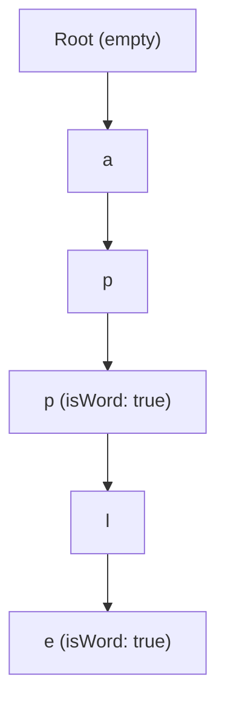

## Concept

A **Trie** (pronounced "try", from the word re**trie**val) is a highly specialized N-ary Tree used specifically for string manipulation and prefix matching.

Imagine you are building Google Search's Autocomplete. A user types `"app"`. You need to instantly find `"apple"`, `"application"`, and `"app"`. 
If you store a dictionary of 1 million words in a Hash Map, you cannot easily find words that *start* with `"app"`. You would have to loop through all 1 million keys.

A Trie solves this by breaking words down into individual characters. Every node in the tree represents a single character.

## Mental Model

Inserting `"app"` and `"apple"`:

Notice how `"app"` and `"apple"` share the exact same physical nodes for the first 3 letters! This provides massive space compression when storing similar words.

## Implementation

Instead of `node.left` and `node.right`, a Trie Node has an **Object (or Hash Map)** of children, allowing it to branch off into 26 different directions (for a-z). 
Crucially, it also has a boolean `isWord` flag to mark the end of a valid dictionary word. (Without `isWord`, the Trie wouldn't know if `"app"` is a real word, or just a stepping stone to get to `"apple"`).

```typescript
class TrieNode {
    // Map of character -> next TrieNode
    children: Map<string, TrieNode>;
    isWord: boolean;

    constructor() {
        this.children = new Map();
        this.isWord = false;
    }
}

class Trie {
    private root: TrieNode;

    constructor() {
        this.root = new TrieNode();
    }

    // O(L) Time, where L is the length of the word
    insert(word: string): void {
        let current = this.root;
        
        for (let char of word) {
            if (!current.children.has(char)) {
                // Character doesn't exist. Create a new path.
                current.children.set(char, new TrieNode());
            }
            // Step forward
            current = current.children.get(char)!;
        }
        
        // Mark the final node as the end of a complete word
        current.isWord = true;
    }

    // O(L) Time
    search(word: string): boolean {
        let current = this.root;
        
        for (let char of word) {
            if (!current.children.has(char)) {
                return false; // Path broke early. Word doesn't exist.
            }
            current = current.children.get(char)!;
        }
        
        // We reached the end of the word. But is it a VALID dictionary word?
        return current.isWord;
    }

    // O(L) Time
    startsWith(prefix: string): boolean {
        let current = this.root;
        
        for (let char of prefix) {
            if (!current.children.has(char)) {
                return false;
            }
            current = current.children.get(char)!;
        }
        
        return true; // We successfully traversed the prefix!
    }
}
```

## Interview Questions

**Q: A developer suggests optimizing the Trie by using an Array of size 26 (`children = new Array(26)`) instead of a Hash Map. Is this better?**
**A:** It depends on the constraints. 
Using a fixed Array of size 26 is extremely fast for CPU access times, and simplifies the code (you just map ASCII `a` to index `0`). 
However, it is highly memory inefficient. Every single node in the tree will physically allocate an array of 26 pointers, even if it only has 1 child. If the Trie contains thousands of long, sparse words, you waste massive amounts of RAM on empty `null` pointers. A Hash Map (or a dynamic array) saves space at the slight cost of hash calculation overhead.

**Q: How does the "Word Search II" (LeetCode 212) problem use a Trie?**
**A:** The problem gives you a 2D grid of letters (a Boggle board) and a massive list of dictionary words, asking you to find all words that exist on the board. 
Running a standard DFS search for every single word individually takes catastrophic $O(W \times 4^L)$ time.
You optimize this by taking the *entire dictionary* and inserting it into a **Trie**. Then, you run a single DFS on the Boggle board. At every letter you touch on the board, you instantly step into the Trie. If the Trie path breaks, you immediately abort the DFS branch! This prunes millions of useless recursion paths, resulting in blazing fast performance.
