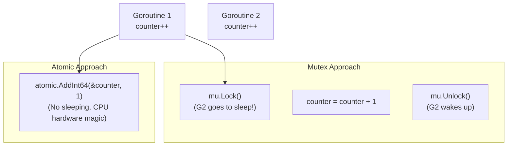

## TL;DR

When multiple goroutines need to increment a shared counter, using a `sync.Mutex` is the standard approach. However, mutexes are slow because they force goroutines to wait in line. The `sync/atomic` package allows you to perform basic math and variable assignments completely lock-free, utilizing special hardware instructions on the CPU.

## Mental Model



## How It Works

A simple `count++` is not one step. At the machine level, it is three steps:
1. Read the current value from RAM into the CPU register.
2. Add 1 to the register.
3. Write the new value back to RAM.
If two goroutines do this simultaneously, they overwrite each other (a Data Race). 

`sync/atomic` functions (like `AddInt64`) map directly to special CPU assembly instructions (like `LOCK XADD` on x86). The CPU hardware guarantees that the entire read-modify-write cycle happens as a single, uninterruptible unit. 

## Example

```go
package main

import (
	"fmt"
	"sync"
	"sync/atomic"
)

func main() {
	var counter int64 = 0
	var wg sync.WaitGroup

	// Spawn 1000 goroutines
	for i := 0; i < 1000; i++ {
		wg.Add(1)
		go func() {
			defer wg.Done()
			
			// BAD: Data Race! Final result will likely be < 1000
			// counter++ 
			
			// GOOD: Lock-free atomic increment. Guaranteed 1000!
			atomic.AddInt64(&counter, 1)
		}()
	}

	wg.Wait()
	
	// Safely read the final value
	finalValue := atomic.LoadInt64(&counter)
	fmt.Println("Final Counter:", finalValue)
}
```

## Common Interview Questions

### Should I replace all my Mutexes with Atomics to make my code faster?
No. `sync/atomic` is extremely limited. It only works on primitive types (`int32`, `int64`, `uintptr`, pointers). You cannot atomically update a complex `User` struct or append to a slice. Use atomics for simple metrics counters or state flags. Use Mutexes for everything else to keep your code readable.

### What is `atomic.Value`?
If you have a global configuration struct that is read by 10,000 goroutines simultaneously, but updated only once an hour by a background thread, an `RWMutex` might still cause slight contention. `atomic.Value` allows you to atomically swap out an entire struct pointer with a brand new one lock-free. Go 1.19 also introduced strongly typed generic atomics like `atomic.Pointer[T]` which make this much safer and easier to use.
