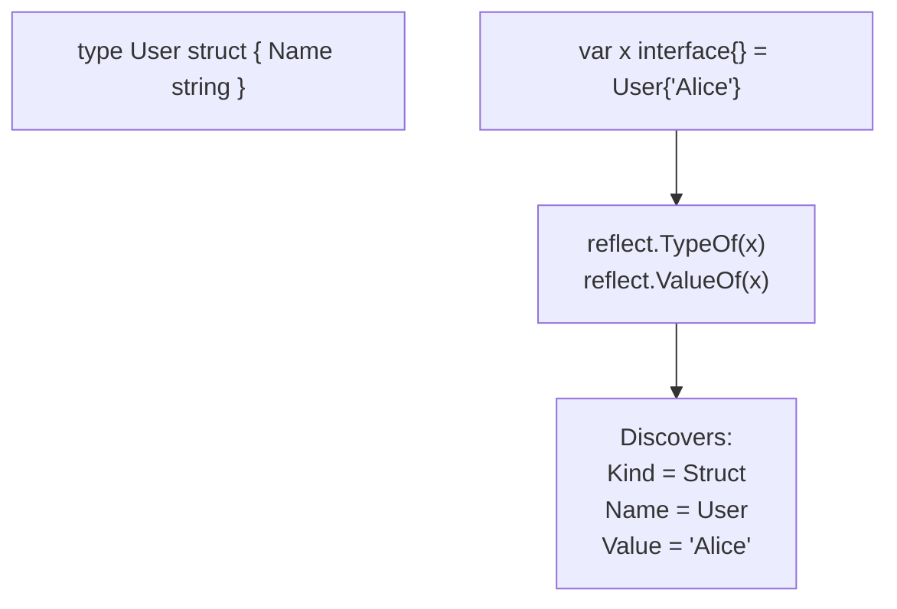

## TL;DR

Go is a strictly typed language. The compiler needs to know what types everything is. However, the `reflect` package allows you to break this rule. It allows your code to inspect, discover, and even modify the type and value of variables *at runtime*. It is incredibly powerful, but extremely slow and dangerous.

## Mental Model



## How It Works

Reflection is heavily used by the standard library.
- When you call `json.Marshal(struct)`, the JSON library uses reflection to look at your struct, find its fields, read the `json:"name"` struct tags, and build the string.
- When you use `fmt.Println`, it uses reflection to figure out how to format whatever random data you passed into it.

**The Two Pillars of Reflection:**
1. `reflect.TypeOf(v)`: Returns the type data (e.g., is it a struct? is it a slice? what are the names of its fields?).
2. `reflect.ValueOf(v)`: Returns the actual data. You can use this to read the values, or (if passed as a pointer) modify the values.

## Example

```go
package main

import (
	"fmt"
	"reflect"
)

type Config struct {
	Host string `env:"HOST_IP"`
	Port int    `env:"HOST_PORT"`
}

func printStructTags(input interface{}) {
	// 1. Get the Type of the input
	t := reflect.TypeOf(input)

	// Ensure the input is actually a struct!
	if t.Kind() != reflect.Struct {
		fmt.Println("Expected a struct")
		return
	}

	// 2. Iterate over the fields of the struct at runtime
	for i := 0; i < t.NumField(); i++ {
		field := t.Field(i)
		
		// 3. Extract the custom tag string
		tag := field.Tag.Get("env")
		
		fmt.Printf("Field: %s, Type: %s, Tag: %s\n", field.Name, field.Type, tag)
	}
}

func main() {
	c := Config{}
	printStructTags(c)
}
```

## Common Interview Questions

### Why shouldn't I use `reflect` everywhere?
1. **Performance**: Reflection is incredibly slow. It bypasses compiler optimizations and requires dynamic heap allocations. `json.Marshal` is actually quite slow compared to code-generated JSON parsers (like `easyjson`) specifically because of reflection.
2. **Safety**: If you use reflection to dynamically call a method or extract a field that doesn't exist, the compiler won't warn you. Your program will violently `panic` at runtime.

### What is the difference between `Type` and `Kind`?
If you define `type MyInt int`.
The `Type` of the variable is `MyInt` (your custom name).
The `Kind` of the variable is `int` (the underlying primitive machine type). Reflection usually cares more about `Kind` so it knows how to handle the memory.
