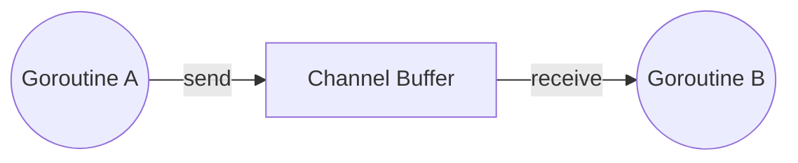

## TL;DR

Channels are a typed conduit through which you can send and receive values with the channel operator, `<-`. They are used to safely communicate data between goroutines.

## Mental Model



## Example

```go
package main

import "fmt"

func main() {
    ch := make(chan int) // Unbuffered channel

    go func() {
        ch <- 42 // Send data to channel
    }()

    value := <-ch // Receive data from channel
    fmt.Println(value)
}
```

## How It Works

1. **Unbuffered Channels**: Provide synchronous handoff. A send operation blocks until a receiver is ready. A receive operation blocks until a sender is ready.
2. **Buffered Channels**: Provide an asynchronous queue. A send only blocks when the buffer is full. A receive only blocks when the buffer is empty.
3. **Directionality**: Channels can be constrained to send-only (`chan<- int`) or receive-only (`<-chan int`).

## Interview Questions

### What happens when you read from a closed channel?
It immediately returns the zero value of the channel's type, along with a boolean `false` indicating the channel is closed.
```go
val, ok := <-ch // ok will be false if closed and empty
```

### What happens when you send to a closed channel?
It causes a **panic**.

### What happens when you read from or write to a `nil` channel?
It **blocks forever**, potentially causing a deadlock.

## Common Gotchas

*   **Deadlocks**: If all goroutines are asleep waiting on channels, the Go runtime detects this and crashes the program with a fatal error.
*   **Forgetting to close**: Memory leaks can occur if the receiver ranges over a channel that is never closed.
*   **Closing multiple times**: Closing an already-closed channel causes a panic.

## Remember

> Don't communicate by sharing memory; share memory by communicating.
