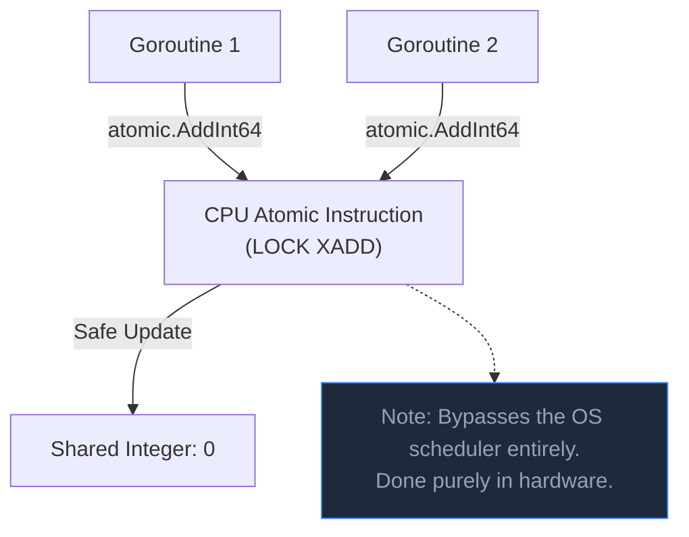

## TL;DR

The `sync/atomic` package provides low-level, hardware-accelerated memory primitives. They allow you to perform simple operations (like adding to an integer or flipping a boolean flag) across multiple goroutines safely, without the heavy performance overhead of acquiring a `sync.Mutex`.

## Mental Model



## How It Works

When you use `counter++`, the CPU actually does three things: Read the memory, Increment the value, Write back to memory. If two goroutines do this at the same millisecond, they overwrite each other (Race Condition). 

A Mutex solves this by locking the code block. 
Atomic operations solve this by instructing the CPU hardware to perform all three steps in one single, unbreakable, "atomic" tick.

In Go 1.19+, the new `atomic.Int64` and `atomic.Bool` types make this incredibly ergonomic compared to the older pointer-based functions.

## Example

```go
package main

import (
	"fmt"
	"sync"
	"sync/atomic"
)

func main() {
	// Using the modern Go 1.19+ atomic types
	var counter atomic.Int64
	var wg sync.WaitGroup

	for i := 0; i < 1000; i++ {
		wg.Add(1)
		go func() {
			// This is completely thread-safe!
			// No Mutex required.
			counter.Add(1) 
			wg.Done()
		}()
	}

	wg.Wait()
	
	// Read the value safely
	fmt.Println("Final Counter:", counter.Load()) // Guaranteed 1000
}
```

## Common Interview Questions

### When should you use `sync.Mutex` instead of `sync/atomic`?
Atomic operations only work for primitive variables (one `int`, one `bool`, or swapping one `pointer`). If you need to update *two* variables simultaneously (e.g., deducting money from Account A and adding to Account B), or protect complex data structures like Maps or Slices, you **must** use a Mutex.

### What is `atomic.Value`?
Before Go 1.18 generics, `atomic.Value` was used to atomically store and load entire Structs or interface values. It is useful for hot-swapping configuration objects globally without blocking readers. In modern Go, you can use `atomic.Pointer[T]` for strongly-typed atomic struct swapping.
