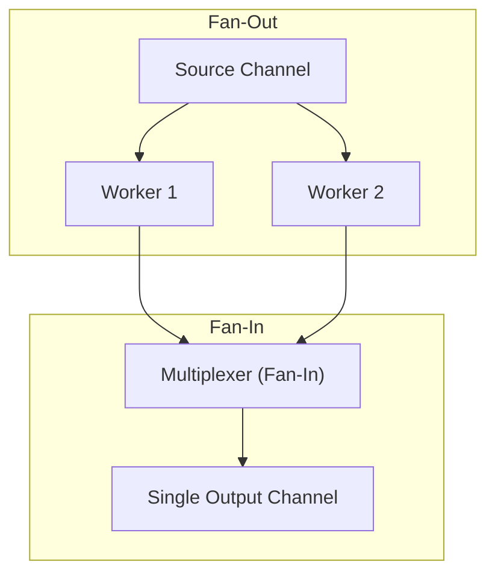

## TL;DR

- **Fan-Out**: Multiple functions reading from the *same* channel until that channel is closed (distributing work).
- **Fan-In**: A single function reading from *multiple* input channels and multiplexing all that data into one single output channel (consolidating results).

## Mental Model



## How It Works

**Fan-Out** is effectively a Worker Pool. You push data into one channel, and 10 goroutines compete to read from it.

**Fan-In** requires a dedicated "Multiplexer" goroutine. It takes a variable number of input channels (`...<-chan int`), loops over them, and spawns a tiny helper goroutine for each one. Each helper reads from its specific input channel and immediately forwards the data to the central output channel.

## Example: Implementing Fan-In

```go
package main

import (
	"fmt"
	"sync"
)

// FanIn takes multiple channels and merges them into a single channel
func merge(channels ...<-chan int) <-chan int {
	var wg sync.WaitGroup
	out := make(chan int)

	// Helper function to copy data from one input channel to 'out'
	output := func(c <-chan int) {
		for n := range c {
			out <- n
		}
		wg.Done()
	}

	wg.Add(len(channels))
	for _, c := range channels {
		go output(c) // Spawn a helper for each input channel
	}

	// Start a background goroutine to close 'out' once all helpers are done.
	// This MUST be in the background, otherwise we block returning the 'out' channel!
	go func() {
		wg.Wait()
		close(out)
	}()

	return out
}

// ... Usage in main ...
// out1 and out2 are channels returning data from workers
// merged := merge(out1, out2)
// for data := range merged { fmt.Println(data) }
```

## Common Interview Questions

### Why is the `close(out)` call inside a separate `go func()`?
If you put `wg.Wait()` and `close(out)` directly in the `merge` function without wrapping them in a goroutine, the `merge` function will block forever. It would wait for the helpers to finish, but the helpers can't finish because no one is reading from the `out` channel yet! By putting the wait/close in the background, `merge` immediately returns the `out` channel to the caller so they can start reading.

### What is the primary use case for Fan-In?
Aggregating search results. Imagine querying Google, Bing, and Yahoo APIs concurrently. Each API query runs in its own goroutine and returns a channel of results. You Fan-In all three channels into a single stream to render them to the user as they arrive, regardless of which API answered first.
