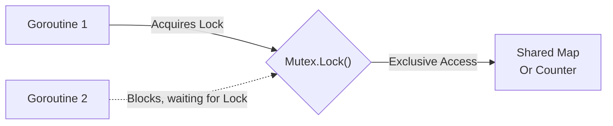

## TL;DR

While Channels are preferred for sharing data, sometimes you just need multiple goroutines to update a single shared map or counter. A **`sync.Mutex`** (Mutual Exclusion lock) ensures that only **one** goroutine can access a critical section of code at a time, preventing Race Conditions.

## Mental Model



## How It Works

- **`Lock()`**: A goroutine claims exclusive access. If another goroutine already holds the lock, this call completely freezes (blocks) until the lock is released.
- **`Unlock()`**: Releases the lock, allowing the next waiting goroutine to acquire it.

If your workload has 99% reads and 1% writes, use a **`sync.RWMutex`** (Read/Write Mutex). It allows infinite simultaneous readers (`RLock()`), but strictly one writer (`Lock()`).

## Example

```go
package main

import (
	"fmt"
	"sync"
)

type SafeCounter struct {
	mu sync.Mutex
	v  map[string]int
}

// Increment safely updates the counter for the given key.
func (c *SafeCounter) Inc(key string) {
	c.mu.Lock()
	
	// Defer ensures Unlock happens even if the code below panics
	defer c.mu.Unlock() 
	
	// CRITICAL SECTION
	c.v[key]++
}

func main() {
	c := SafeCounter{v: make(map[string]int)}
	var wg sync.WaitGroup

	// 1000 goroutines trying to update the same map simultaneously!
	for i := 0; i < 1000; i++ {
		wg.Add(1)
		go func() {
			c.Inc("visitors")
			wg.Done()
		}()
	}

	wg.Wait()
	fmt.Println("Total visitors:", c.v["visitors"]) // Guaranteed 1000
}
```

## Common Interview Questions

### Should I use a Channel or a Mutex?
Go's philosophy states: *Share memory by communicating (channels)*. However, the official wiki clarifies: Use Channels when passing ownership of data, coordinating work, or routing events. Use Mutexes when protecting simple, shared internal state (like caching maps, counters, or basic structs).

### What happens if you forget to `Unlock()` a Mutex?
Every other goroutine that attempts to call `Lock()` will block forever. This creates a **Deadlock**. The application will freeze, and eventually the Go runtime will crash the program with a fatal error if all goroutines are deadlocked. Always use `defer mu.Unlock()` immediately after acquiring the lock to guarantee it gets released.
