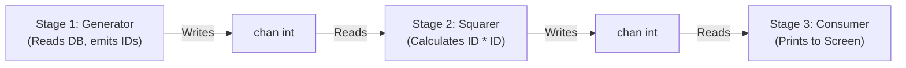

## TL;DR

A **Pipeline** is a series of stages connected by channels. Each stage is a group of goroutines running the same function. In each stage, the goroutines receive values from an upstream channel, perform some transformation on that data, and send the new values to a downstream channel.

## Mental Model



## How It Works

Pipelines heavily utilize the concept that functions should return channels: `func doWork(in <-chan int) <-chan int`.
This allows you to chain them together elegantly: `Stage3(Stage2(Stage1()))`.

Pipelines are incredibly powerful for batch processing massive datasets (like a 50GB CSV file). Instead of loading the whole file into RAM, Stage 1 reads a single line and pushes it to the channel. Stage 2 parses it. Stage 3 saves it to the DB. Memory usage remains tiny and constant, and all CPU cores are utilized simultaneously.

## Example

```go
package main

import "fmt"

// Stage 1: Generates a stream of numbers
func generate(nums ...int) <-chan int {
	out := make(chan int)
	go func() {
		for _, n := range nums {
			out <- n
		}
		close(out)
	}()
	return out
}

// Stage 2: Transforms the data
func square(in <-chan int) <-chan int {
	out := make(chan int)
	go func() {
		for n := range in {
			out <- n * n
		}
		close(out) // Always close output channel when input is done!
	}()
	return out
}

func main() {
	// Set up the pipeline: Generator -> Squarer
	c := generate(2, 3, 4)
	out := square(c)

	// Stage 3: Consume the output
	for result := range out {
		fmt.Println(result) // Prints 4, 9, 16
	}
}
```

## Common Interview Questions

### What happens if Stage 3 stops reading early (e.g., an error occurred)?
This causes a massive **Goroutine Leak**. Stage 1 and Stage 2 are stuck trying to write to channels that nobody is reading from anymore. Because they are blocked on channel writes, they will never exit, holding onto memory forever. 

### How do you prevent Goroutine Leaks in Pipelines?
You must explicitly signal to upstream stages that they should stop processing and exit. You do this by passing a `context.Context` (or a dedicated `done` channel) into every single stage of the pipeline. If an error occurs, you cancel the context, and all stages `select` on `<-ctx.Done()` to exit gracefully.
