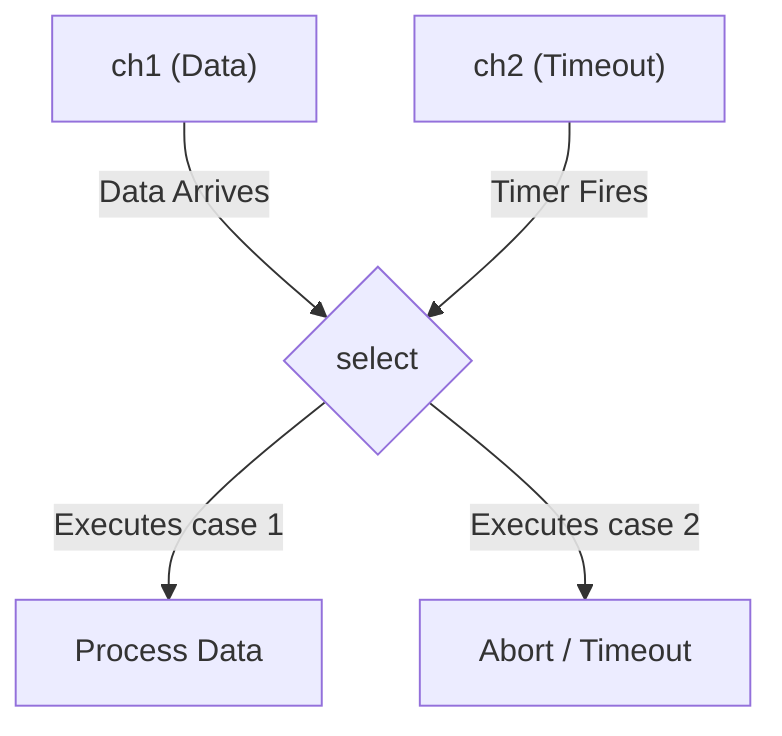

## TL;DR

The **`select`** statement acts like a `switch` statement, but specifically for Channels. It allows a single goroutine to wait on multiple channel operations (reads or writes) at the same time. It blocks until *one* of the channels is ready.

## Mental Model



## How It Works

If you try to read from a channel `<-ch1`, your goroutine completely blocks until `ch1` has data. If you also need to listen to `ch2`, you are stuck.

`select` solves this. You define multiple cases for different channels. Go evaluates them all. 
- If none are ready, it blocks.
- If one is ready, it executes that case.
- If *multiple* are ready simultaneously, Go picks one completely at **random** to prevent starvation.
- If you include a `default` case, it executes instantly if no channels are ready (making the select non-blocking).

## Example

```go
package main

import (
	"fmt"
	"time"
)

func main() {
	fastAPI := make(chan string)
	slowAPI := make(chan string)

	go func() {
		time.Sleep(10 * time.Millisecond)
		fastAPI <- "Fast Data"
	}()

	go func() {
		time.Sleep(100 * time.Millisecond)
		slowAPI <- "Slow Data"
	}()

    // We wait for whichever API responds first, or a hard timeout.
	select {
	case res := <-fastAPI:
		fmt.Println("Received:", res)
	case res := <-slowAPI:
		fmt.Println("Received:", res)
	case <-time.After(50 * time.Millisecond):
		// This channel receives a value after 50ms
		fmt.Println("Timeout! APIs took too long.")
	}
}
```

## Common Interview Questions

### What does an empty `select {}` do?
It blocks the current goroutine forever. It is sometimes used at the very end of `main()` to prevent the application from exiting if the app is entirely driven by background goroutines (like a web server).

### How do you implement a non-blocking channel read?
Use a `select` statement with a `default` case.
```go
select {
case msg := <-ch:
    fmt.Println("Got message:", msg)
default:
    fmt.Println("No message available right now, moving on.")
}
```
This is useful if you want to poll a channel without getting stuck.
