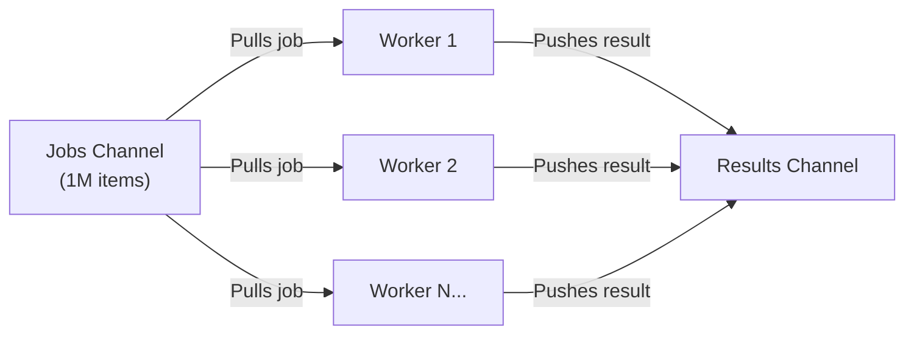

## TL;DR

A **Worker Pool** is a concurrency pattern used to limit the number of active goroutines. Instead of spawning 1,000,000 goroutines to process 1,000,000 jobs (which might exhaust your memory or crash a database with too many connections), you spawn a fixed number of "Workers" (e.g., 100) that constantly pull jobs from a shared queue (Channel).

## Mental Model



## How It Works

1. Create a `jobs` channel and a `results` channel.
2. Spawn a fixed number `N` of worker goroutines. Each worker runs a `for job := range jobs` loop.
3. The main thread iterates over all tasks, pushing them into the `jobs` channel.
4. Because the workers are reading from the channel concurrently, Go automatically distributes the jobs among the available workers.
5. Close the `jobs` channel when all tasks are dispatched. The workers will automatically exit their loops when the channel is empty.

## Example

```go
package main

import (
	"fmt"
	"time"
)

// The Worker function
func worker(id int, jobs <-chan int, results chan<- int) {
    // This loop runs until the 'jobs' channel is closed!
	for j := range jobs {
		fmt.Printf("Worker %d started job %d\n", id, j)
		time.Sleep(time.Second) // Simulate heavy CPU work
		results <- j * 2
	}
}

func main() {
	const numJobs = 5
	jobs := make(chan int, numJobs)
	results := make(chan int, numJobs)

	// 1. Start exactly 3 workers
	for w := 1; w <= 3; w++ {
		go worker(w, jobs, results)
	}

	// 2. Send 5 jobs into the channel
	for j := 1; j <= numJobs; j++ {
		jobs <- j
	}
	// 3. Close the channel so workers know no more jobs are coming
	close(jobs)

	// 4. Collect all the results
	for a := 1; a <= numJobs; a++ {
		<-results
	}
}
```

## Common Interview Questions

### If Goroutines are so cheap, why do we need Worker Pools?
While it's true you can easily spawn 100,000 goroutines, the *systems those goroutines interact with* often cannot handle that concurrency. If every goroutine opens a file, you will hit the OS `ulimit` (Too many open files). If every goroutine hits an external API, you will get rate-limited. Worker pools act as a throttle to protect downstream services.

### How is this different from a WaitGroup?
A WaitGroup just waits for a dynamic number of tasks to finish, but provides no cap on *how many* run simultaneously. You often use a WaitGroup *inside* a Worker Pool to wait for the workers themselves to finish exiting!
