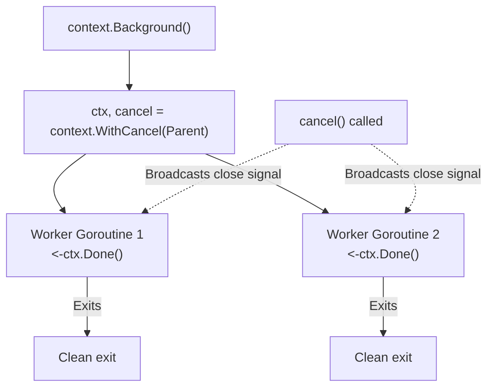

## TL;DR

`context.WithCancel(parent)` returns a new context and a `cancel()` function. When you call `cancel()`, the context's internal `.Done()` channel is closed. Any goroutines listening to `<-ctx.Done()` will instantly unblock and should exit gracefully.

## Mental Model



## How It Works

Closing a channel in Go broadcasts a signal to *every* goroutine reading from that channel. The `context` package utilizes this under the hood. 
When `cancel()` is invoked, the `ctx.Done()` channel is closed. All worker goroutines blocked on a `select` statement watching `ctx.Done()` will immediately execute that case and return.

*Crucial:* You must **always** call the `cancel()` function (usually via `defer cancel()`) when the parent function finishes. If you don't, the context and its associated timer/state stay in memory until the parent context dies (a memory leak).

## Example

```go
package main

import (
	"context"
	"fmt"
	"time"
)

func streamLogs(ctx context.Context) {
	for {
		select {
		case <-ctx.Done():
			// The cancel signal was received!
			fmt.Println("Stream shutting down...")
			return
		default:
			// No cancel signal, keep working
			fmt.Println("Streaming log line...")
			time.Sleep(500 * time.Millisecond)
		}
	}
}

func main() {
	ctx, cancel := context.WithCancel(context.Background())
	
	// Start the infinite background worker
	go streamLogs(ctx)

	// Let it run for 2 seconds
	time.Sleep(2 * time.Second)

	fmt.Println("Main thread deciding to stop the stream.")
	
	// Manually trigger the cancellation!
	cancel() 
	
	// Give the goroutine a moment to print its shutdown message
	time.Sleep(100 * time.Millisecond) 
}
```

## Common Interview Questions

### How does cancellation propagate?
Contexts form a tree. If you have a Root Context, and you derive Context A from it, and Context B from A. If you cancel Context A, Context B is **automatically** canceled as well. However, canceling B does not affect A. Cancellation propagates strictly downwards.

### What does `ctx.Err()` return?
Before cancellation, `ctx.Err()` returns `nil`. 
If `cancel()` was called manually, it returns `context.Canceled`. 
If the context was a timeout that expired, it returns `context.DeadlineExceeded`. This is useful to figure out *why* the context died.
