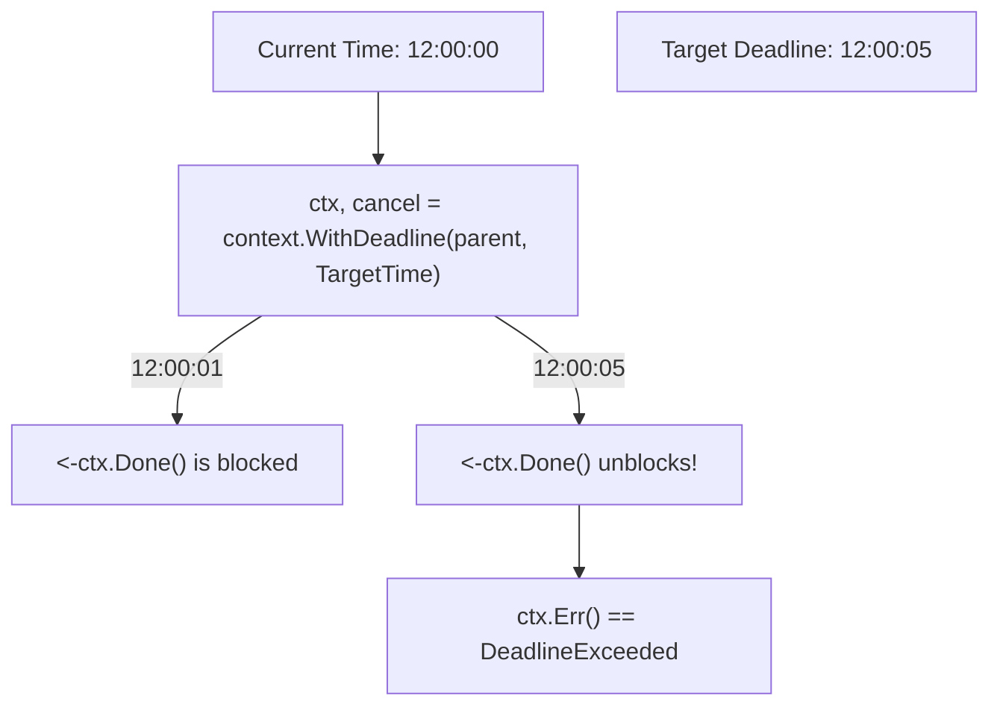

## TL;DR

`context.WithDeadline(parent, targetTime)` allows you to create a context that automatically cancels itself at a specific, absolute point in the future (e.g., "Cancel at 5:00 PM"). It functions identically to `WithTimeout`, but takes a specific `time.Time` instead of a `time.Duration`.

## Mental Model



## How It Works

Deadlines are useful in distributed systems when you want to enforce a global SLA (Service Level Agreement). 

For example, if your HTTP API promises to respond within 500ms, you calculate the absolute deadline timestamp (`time.Now().Add(500 * time.Millisecond)`) at the very edge of the router. You then pass this Deadline Context down through 5 layers of microservices. Even if Service A takes 400ms, Service B will know it only has 100ms left before the absolute deadline hits.

## Example

```go
package main

import (
	"context"
	"fmt"
	"time"
)

func processTask(ctx context.Context) {
	// Check if the context even has a deadline set
	if deadline, ok := ctx.Deadline(); ok {
		fmt.Printf("Task knows it must finish by: %v\n", deadline.Format("15:04:05"))
	}

	select {
	case <-time.After(5 * time.Second):
		fmt.Println("Task finished successfully!")
	case <-ctx.Done():
		fmt.Println("Task aborted! Reason:", ctx.Err())
	}
}

func main() {
	// Calculate an absolute time in the future (3 seconds from now)
	absoluteDeadline := time.Now().Add(3 * time.Second)

	ctx, cancel := context.WithDeadline(context.Background(), absoluteDeadline)
	defer cancel() // Still required to prevent timer leaks!

	fmt.Println("Current time:", time.Now().Format("15:04:05"))
	
	processTask(ctx)
}
```

## Common Interview Questions

### What happens if I set a deadline that is already in the past?
The context is created in an immediately-canceled state. Any code listening to `<-ctx.Done()` will unblock instantly, and `ctx.Err()` will return `context.DeadlineExceeded`.

### Why must I `defer cancel()` if the deadline is going to cancel it automatically anyway?
The `WithDeadline` function starts a background timer in the Go runtime. If your function finishes its work *faster* than the deadline, that timer is still ticking in the background, consuming memory until it fires. Calling the returned `cancel()` function immediately stops and cleans up that internal timer.
