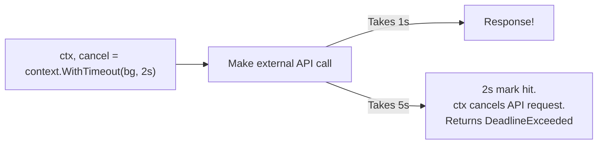

## TL;DR

`context.WithTimeout(parent, duration)` is the most common way to enforce time limits in Go. It automatically cancels the context after a specific `time.Duration` has passed (e.g., "Cancel in 2 seconds"). Under the hood, it simply calls `WithDeadline(parent, time.Now().Add(timeout))`.

## Mental Model



## How It Works

Every external interaction in your Go code (database queries, Redis calls, external HTTP requests) **must** have a timeout. Without them, a single slow third-party API can cause your entire server to freeze as thousands of goroutines get stuck waiting forever, eventually exhausting your server's memory.

The standard library's `net/http` client and `database/sql` packages natively support Context. If the context times out, they will literally sever the TCP connection to abort the request immediately.

## Example

```go
package main

import (
	"context"
	"fmt"
	"io"
	"net/http"
	"time"
)

func fetchGoogle(ctx context.Context) error {
	// 1. Create a new HTTP Request, attaching our context to it
	req, err := http.NewRequestWithContext(ctx, "GET", "https://google.com", nil)
	if err != nil {
		return err
	}

	// 2. Execute the request
	client := &http.Client{}
	res, err := client.Do(req)
	if err != nil {
		return err // If timeout hits, this error will be "context deadline exceeded"
	}
	defer res.Body.Close()

	body, _ := io.ReadAll(res.Body)
	fmt.Printf("Success! Read %d bytes\n", len(body))
	return nil
}

func main() {
	// Let's set a ridiculously aggressive timeout of 1 millisecond
	// to force a timeout failure.
	ctx, cancel := context.WithTimeout(context.Background(), 1*time.Millisecond)
	defer cancel() // Prevent timer leaks

	fmt.Println("Attempting to fetch...")
	
	err := fetchGoogle(ctx)
	if err != nil {
		fmt.Println("Fetch failed:", err)
	}
}
```

## Common Interview Questions

### Can I change a timeout after the context is created?
**No.** Contexts are completely immutable. Once a timeout is set, it cannot be extended or reduced. If you need to "reset" a timeout, you must create a brand new context.

### What if I wrap a 1-second timeout context in a 5-second timeout context?
Because contexts form a tree, the *shortest* timeout always wins. If Parent expires in 1s, it will cancel its children, forcing the Child to expire in 1s, even if the Child was initialized with a 5s timeout.
