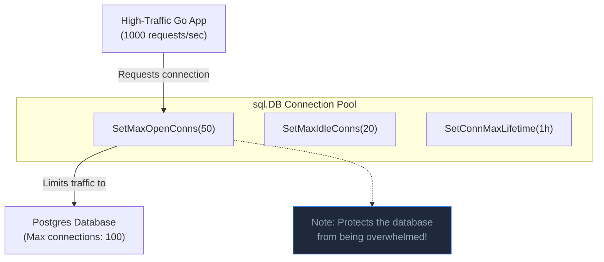

## TL;DR

The default `*sql.DB` connection pool settings are meant for local testing. In production, if you don't explicitly configure limits, Go will open an infinite number of connections to your database under heavy load, causing your Postgres/MySQL server to crash with an "OOM" (Out of Memory) or "Too Many Connections" error.

## Mental Model



## How It Works

You configure the pool using four methods on `*sql.DB`:

1. **`SetMaxOpenConns(n)`**: The absolute maximum number of connections allowed to the DB. If 50 requests come in and `n=10`, 10 will get a connection, and the other 40 will block (wait) until a connection is returned to the pool.
2. **`SetMaxIdleConns(n)`**: How many connections to keep open in the background when there is no traffic. Opening a DB connection is slow (TCP/TLS handshake). Keeping them "Idle" makes subsequent requests lightning fast.
3. **`SetConnMaxLifetime(duration)`**: Forces connections to close after a certain time, preventing stale connections from being dropped by intermediate firewalls.
4. **`SetConnMaxIdleTime(duration)`**: Closes idle connections after a certain time to free up memory on the DB server during quiet hours.

## Example

```go
package main

import (
	"database/sql"
	"log"
	"time"

	_ "github.com/lib/pq"
)

func main() {
	db, err := sql.Open("postgres", "dsn...")
	if err != nil {
		log.Fatal(err)
	}

	// 1. Cap the max connections based on your DB's capacity.
	// (Postgres usually defaults to 100 max connections total).
	db.SetMaxOpenConns(50)

	// 2. Keep 20 connections open to handle sudden traffic spikes instantly.
	// RULE: MaxIdleConns should be <= MaxOpenConns.
	db.SetMaxIdleConns(20)

	// 3. Recycle connections every hour.
	// Ensures firewalls don't silently drop long-lived TCP connections.
	db.SetConnMaxLifetime(time.Hour)

	// 4. If traffic is low, clean up idle connections after 5 minutes.
	db.SetConnMaxIdleTime(5 * time.Minute)

	// Pass 'db' to your application...
}
```

## Common Interview Questions

### What happens if `MaxIdleConns` is much lower than `MaxOpenConns`?
If `MaxOpen=100` and `MaxIdle=2`, and you get a sudden spike of 100 requests: Go will open 100 connections. When the requests finish, Go tries to return the 100 connections to the idle pool. But the idle pool only has room for 2! So Go instantly destroys 98 connections. If another spike hits a second later, Go has to expensively recreate all 98 connections. Set `MaxIdle` relatively close to `MaxOpen` to maintain high performance.

### How do I know if my connection pool is a bottleneck?
You can query `db.Stats()`. It returns a struct showing `OpenConnections`, `InUse`, `Idle`, and crucially: `WaitCount` and `WaitDuration`. If `WaitCount` is rapidly increasing, it means your goroutines are spending most of their time waiting for a free DB connection. You either need to increase `MaxOpenConns`, or fix slow queries that are holding onto connections for too long.
