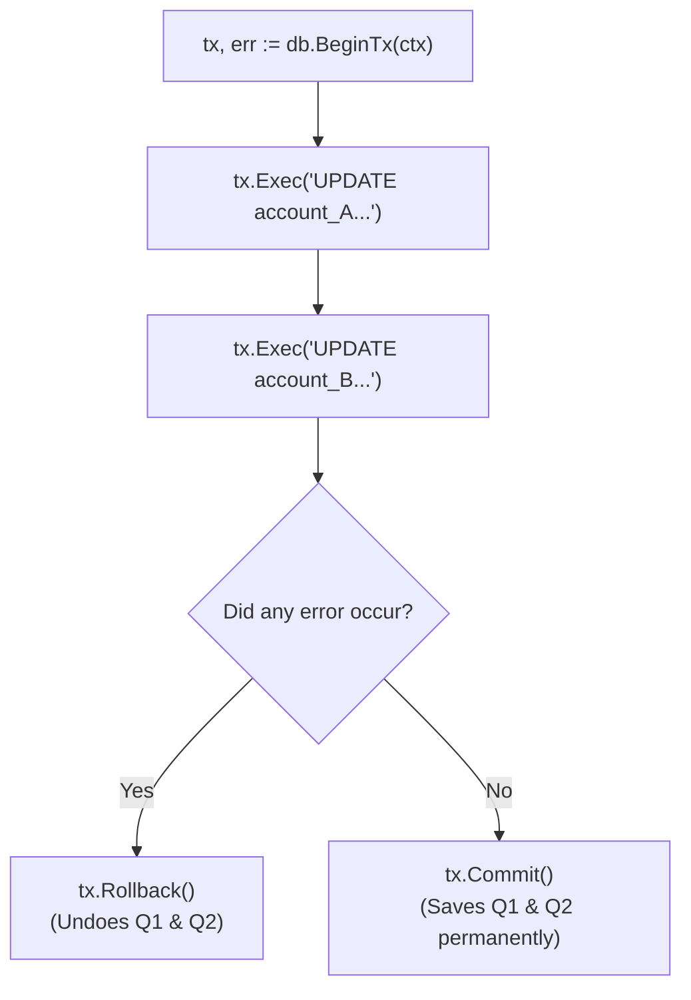

## TL;DR

When you execute multiple related SQL queries (like deducting money from Account A and adding it to Account B), they must all succeed, or all fail together. If the server crashes in the middle, you don't want missing money. A Database **Transaction** guarantees "All or Nothing" execution.

## Mental Model



## How It Works

Instead of calling `db.Query()`, you call `db.BeginTx()`. This reserves a single, dedicated connection from the connection pool and starts a transaction block on the database server.
You then use the returned `*sql.Tx` object to execute queries.
- If everything works perfectly, you call `tx.Commit()`.
- If an error occurs anywhere, you call `tx.Rollback()` to undo any partial changes.

**CRITICAL RULE:** Always use `defer tx.Rollback()` immediately after starting a transaction. This acts as an ironclad safety net. If the function panics or you forget to commit, the deferred rollback automatically releases the locked database connection. (If the transaction was already successfully committed, the rollback does nothing).

## Example

```go
package main

import (
	"context"
	"database/sql"
	"fmt"
	"log"

	_ "github.com/lib/pq"
)

func transferMoney(ctx context.Context, db *sql.DB, fromID, toID int, amount float64) error {
	// 1. Start the transaction
	tx, err := db.BeginTx(ctx, nil)
	if err != nil {
		return err
	}

	// 2. CRITICAL SAFETY NET!
	// If the function returns early due to an error, this will undo everything.
	// If tx.Commit() is called at the end, this becomes a harmless no-op.
	defer tx.Rollback()

	// 3. Execute Query 1
	_, err = tx.ExecContext(ctx, "UPDATE accounts SET balance = balance - $1 WHERE id = $2", amount, fromID)
	if err != nil {
		return err // Returns early, triggering the deferred Rollback!
	}

	// 4. Execute Query 2
	_, err = tx.ExecContext(ctx, "UPDATE accounts SET balance = balance + $1 WHERE id = $2", amount, toID)
	if err != nil {
		return err // Returns early, triggering the deferred Rollback!
	}

	// 5. Success! Permanently save the changes.
	if err = tx.Commit(); err != nil {
		return err
	}
	
	fmt.Println("Transfer successful!")
	return nil
}
```

## Common Interview Questions

### Can I run queries concurrently inside a single `*sql.Tx`?
**No!** A `*sql.Tx` represents a *single* database connection. If you spawn 5 goroutines and pass them the same `tx` object to run queries simultaneously, you will corrupt the connection state and panic the driver. If you need concurrent queries, they must be on separate connections (use `db.Query()` directly), or separate transactions.

### What is the `Isolation Level` in `db.BeginTx()`?
The second argument to `BeginTx` is a `TxOptions` struct where you can specify the Isolation Level. This controls how the database handles concurrent transactions interfering with each other. The default is whatever your DB is configured to (usually `ReadCommitted`). If you need absolute strictness (preventing phantom reads), you can set it to `sql.LevelSerializable`, though this drastically reduces database performance.
