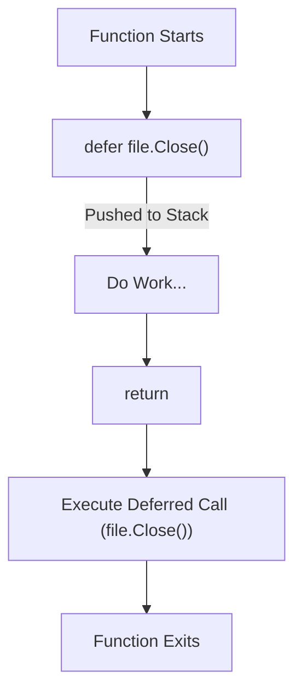

## TL;DR

The `defer` keyword delays the execution of a function until the surrounding function returns. It is primarily used for cleanup operations like closing files, releasing locks, or closing network connections.

## Mental Model



## Example

```go
package main

import (
	"fmt"
	"os"
)

func readFile(filename string) {
	file, err := os.Open(filename)
	if err != nil {
		fmt.Println("Error:", err)
		return
	}
	
	// Ensure the file is closed when readFile exits,
	// regardless of whether it exits normally or panics!
	defer file.Close()

	// Read from the file...
	fmt.Println("Reading file...")
}
```

## How It Works

1.  **Arguments are evaluated immediately**: When a `defer` statement is encountered, the arguments to the deferred function are evaluated *immediately*, but the function call itself is delayed.
2.  **LIFO Execution**: Deferred function calls are pushed onto a stack. When the function returns, its deferred calls are executed in **Last-In-First-Out (LIFO)** order.

## Interview Questions

### What is the output of this code?
```go
func main() {
	for i := 0; i < 3; i++ {
		defer fmt.Print(i)
	}
}
```
**Output**: `210`. Because defers are pushed to a stack and executed LIFO. The arguments are evaluated immediately, so it stores `0`, `1`, `2`, and then prints them in reverse.

### Can a deferred function read or modify the return values?
Yes! If the surrounding function uses **named return values**, the deferred function can access and modify them before the function officially exits.
```go
func c() (i int) {
    defer func() { i++ }()
    return 1 // The defer increments 'i' to 2 before returning!
}
```

## Common Gotchas

*   **Defers in loops**: If you open a database connection or file inside a large loop and use `defer file.Close()`, the `Close()` will NOT execute until the *entire surrounding function* returns. This can lead to resource exhaustion (e.g., running out of file descriptors). 
    *   *Fix*: Wrap the loop body in an anonymous function so the defer executes per iteration.

## Remember

> Defer is Go's elegant answer to `try/finally` blocks for resource cleanup.
