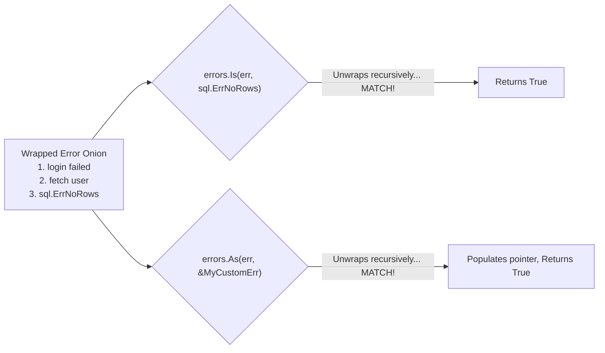

## TL;DR

When errors are wrapped inside each other like an onion, a simple `if err == sql.ErrNoRows` will fail (because `err` is actually a wrapper object). 
- Use **`errors.Is()`** to check if a specific *value* (sentinel error) exists anywhere inside the onion.
- Use **`errors.As()`** to extract a specific *custom error type* from anywhere inside the onion.

## Mental Model



## How It Works

### `errors.Is(err, target)`
This checks for equality. It takes your error, checks if it equals the target. If not, it unwraps it, checks again, unwraps it, checks again, until it hits the bottom. This replaces the old `err == target` pattern.

### `errors.As(err, targetPointer)`
This checks for types. It takes your error and checks if it (or any wrapped error inside it) matches the *type* of the provided pointer. If it finds a match, it actually assigns the matched error data into your pointer so you can use its fields! This replaces the old type assertion `if val, ok := err.(CustomErr)`.

## Example

```go
package main

import (
	"errors"
	"fmt"
)

// 1. A Sentinel Error Value (used with errors.Is)
var ErrNotFound = errors.New("item not found")

// 2. A Custom Error Type (used with errors.As)
type HTTPError struct {
	Code int
	Msg  string
}
func (e *HTTPError) Error() string { return e.Msg }

func doWork() error {
	// Let's simulate a deep error chain
	rootErr := &HTTPError{Code: 404, Msg: "User DB missing"}
	wrap1 := fmt.Errorf("database lookup failed: %w", rootErr)
	wrap2 := fmt.Errorf("process aborted: %w", wrap1)
	
	return wrap2 // Returning the giant wrapped onion
}

func main() {
	err := doWork()

	// --- 1. Checking for exact values ---
	// Even though err is a giant wrapped string, this finds the root!
	if errors.Is(err, ErrNotFound) {
		fmt.Println("We got a not found error!")
	}

	// --- 2. Checking for types & extracting data ---
	// We create an empty pointer
	var httpErr *HTTPError
	
	// errors.As unwraps the onion, finds the HTTPError struct, 
	// and populates our 'httpErr' variable with its data!
	if errors.As(err, &httpErr) {
		fmt.Printf("Extracted HTTP Code: %d\n", httpErr.Code) // 404
	}
}
```

## Common Interview Questions

### Why does `errors.As` require a pointer to a pointer?
`errors.As(err, target)` modifies the target. In Go, to modify a variable inside a function, you must pass a pointer. Since custom errors are usually already pointers (`*HTTPError`), you must pass a pointer *to that pointer* (`&httpErr`) so `errors.As` can overwrite the memory address to point to the extracted error. If you pass a non-pointer, `errors.As` will panic!
