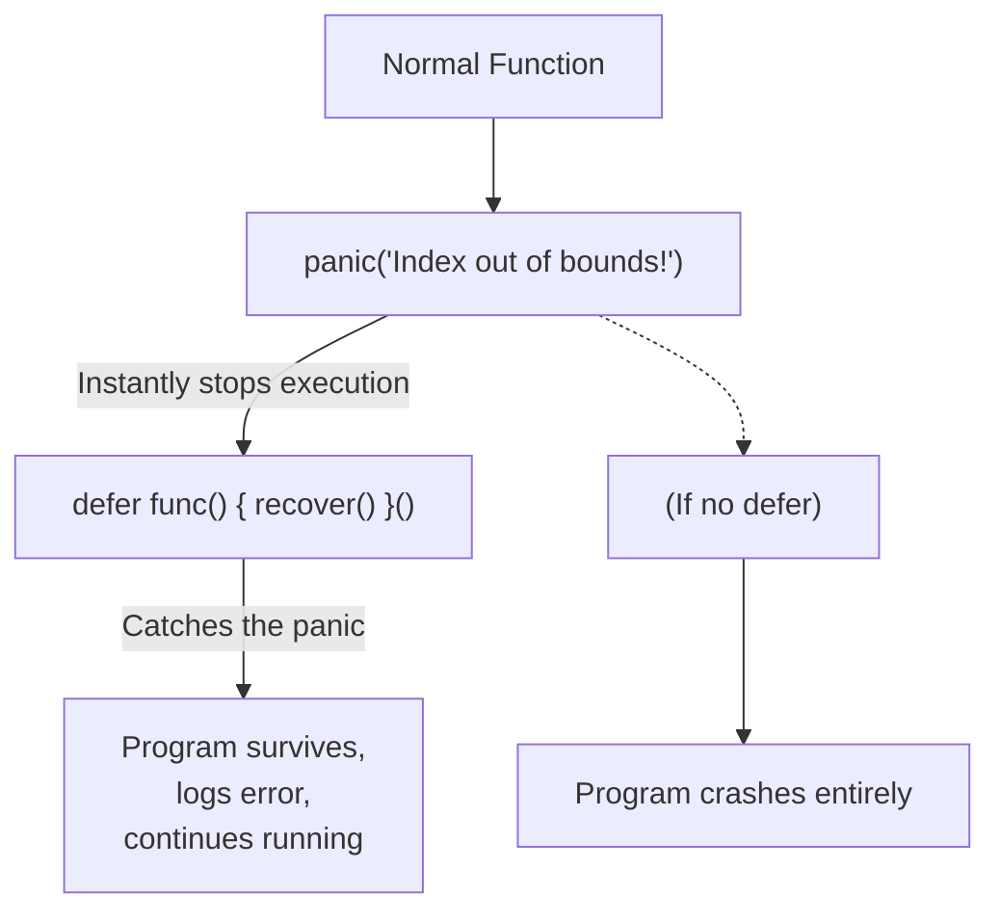

## TL;DR

Go doesn't use exceptions for normal control flow, but it does have **`panic`** for truly unrecoverable, catastrophic errors (like out of memory, or a nil pointer dereference). A panic instantly stops the current function, unwinds the stack, and crashes the program. You can stop the crash and salvage the application using **`recover`** inside a deferred function.

## Mental Model



## How It Works

- **`panic(msg)`**: Throws a fatal exception. The function stops immediately.
- **`defer`**: Functions marked with `defer` are guaranteed to run right before a function exits, *even if the function is panicking*.
- **`recover()`**: A built-in function that stops the panicking sequence. It returns the value that was passed to `panic()`. It **only works if called directly inside a deferred function**.

## Example

```go
package main

import "fmt"

func riskyOperation() {
	// 1. Setup the safety net using defer
	defer func() {
		// 2. recover() stops the crash and grabs the panic message
		if r := recover(); r != nil {
			fmt.Println("Recovered from a catastrophic crash:", r)
		}
	}()

	fmt.Println("Starting risky operation...")
	
	// 3. Something terrible happens (or someone calls panic explicitly)
	var slice []int
	_ = slice[10] // Panics! Index out of bounds on a nil slice
	
	// This line is NEVER reached
	fmt.Println("Operation finished successfully.") 
}

func main() {
	riskyOperation()
	
	// Because of recover(), the main thread is totally fine!
	fmt.Println("Main thread continues happily.")
}
```

## Common Interview Questions

### Should I use Panic/Recover instead of `if err != nil`?
**Absolutely Not.** Using panics for standard control flow (like validating user input or handling a missing file) is considered a massive anti-pattern in Go. Panics are exclusively for unrecoverable developer bugs (nil pointers, index out of bounds) or fatal startup issues (cannot connect to the database on boot).

### Can `recover()` catch a panic in a different goroutine?
**No.** Panics are isolated to the goroutine they occur in. If Goroutine A spawns Goroutine B, and Goroutine B panics, `recover()` in Goroutine A will do nothing, and the entire application will crash. If you spawn a background goroutine, it must have its *own* `defer recover()` block if you want to protect the server from crashing. This is why web frameworks (like Gin) automatically inject a recovery middleware into every single HTTP request goroutine.
