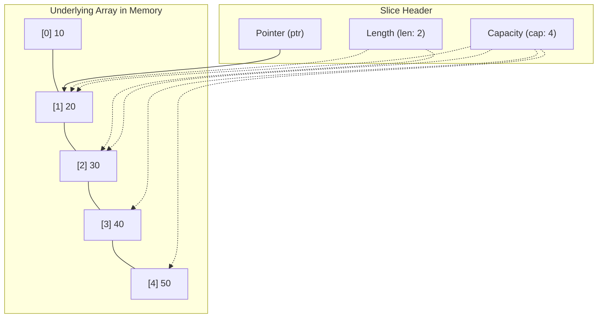

## TL;DR

- **Arrays** have a fixed, unchangeable length defined at compile time. 
- **Slices** are dynamic, growable windows (references) that point to an underlying Array. You will use Slices 99% of the time in Go.

## Mental Model



## How It Works

### Arrays
An array's size is part of its type. `[3]int` and `[4]int` are completely different types. When you pass an array to a function, Go copies the entire array by value (which is slow for large arrays).

### Slices
A slice is just a tiny struct (the "Slice Header") containing three things:
1. A pointer to the underlying array.
2. The `length` (how many elements it currently holds).
3. The `capacity` (how many elements the underlying array can hold before it needs to allocate new memory).

When you pass a slice to a function, you are only copying the tiny header, not the data itself.

## Example

```go
package main

import "fmt"

func main() {
	// 1. ARRAY (Fixed Size)
	var arr [5]int = [5]int{10, 20, 30, 40, 50}

	// 2. SLICE (Dynamic Window into the Array)
	// Takes elements from index 1 up to (but not including) index 3
	mySlice := arr[1:3] 
	
	fmt.Println(mySlice) // [20 30]
	fmt.Printf("Len: %d, Cap: %d\n", len(mySlice), cap(mySlice)) // Len: 2, Cap: 4

	// Modifying the slice modifies the underlying array!
	mySlice[0] = 999
	fmt.Println(arr) // [10 999 30 40 50]
	
	// 3. Creating a Slice directly (using make)
	// Creates a slice of length 0, capacity 10
	dynamicSlice := make([]int, 0, 10) 
	dynamicSlice = append(dynamicSlice, 1)
}
```

## Common Interview Questions

### What happens when you `append()` to a slice that has reached its capacity?
Go will allocate a brand new, larger array in memory (usually double the size of the old one), copy all the existing elements over to the new array, append the new element, and then return a new slice header pointing to this new array. The old array will eventually be garbage collected.

### Is passing a slice to a function pass-by-value or pass-by-reference?
Technically, **everything in Go is pass-by-value**. However, because a slice is a struct containing a *pointer*, that pointer is copied by value. The copied pointer still points to the same underlying array! So if you modify an element (`s[0] = 1`), the caller sees the change. But if you `append()` inside the function, the caller will *not* see the new elements unless you return the new slice header.
