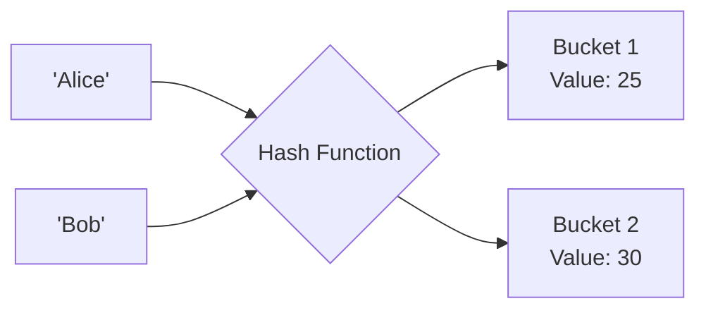

## TL;DR

A **Map** in Go is an unordered collection of key-value pairs (a hash table). It provides average O(1) time complexity for lookups, inserts, and deletes. Like slices, maps act as reference types.

## Mental Model



## How It Works

You declare a map using the syntax `map[KeyType]ValueType`.
The `KeyType` must be a comparable type (e.g., strings, integers, structs). You cannot use slices, maps, or functions as keys because they cannot be compared with `==`.

*Important:* The zero value of a map is `nil`. You cannot write to a `nil` map; it will cause a runtime panic. You must initialize it using `make()` or a map literal.

## Example

```go
package main

import "fmt"

func main() {
	// ERROR: This is a nil map. Writing to it will panic!
	// var badMap map[string]int
	// badMap["Alice"] = 25 

	// CORRECT: Using make()
	ages := make(map[string]int)
	ages["Alice"] = 25
	ages["Bob"] = 30

	// 1. Retrieving a value
	fmt.Println(ages["Alice"]) // 25

	// 2. The "Comma Ok" idiom (Checking if a key exists)
	// If the key is missing, Go returns the zero value (0). 
	// How do we know if Charlie is 0 years old, or just missing?
	age, exists := ages["Charlie"]
	if !exists {
		fmt.Println("Charlie is not in the map")
	}

	// 3. Deleting a key
	delete(ages, "Bob")
	
	// 4. Iterating (Order is NEVER guaranteed!)
	for key, value := range ages {
		fmt.Printf("%s is %d\n", key, value)
	}
}
```

## Common Interview Questions

### Are maps thread-safe in Go?
**No.** Reading and writing to a standard map concurrently from multiple goroutines will cause a fatal runtime crash (`fatal error: concurrent map read and map write`). If you need concurrent access, you must protect the map with a `sync.RWMutex`, or use `sync.Map` (which is optimized for append-only or read-heavy workloads).

### Why is map iteration order random?
Go intentionally randomizes the map iteration order every time you run a `for ... range` loop. The developers did this specifically to prevent programmers from accidentally relying on the internal hash layout of the map, which can change between Go versions. If you need sorted keys, you must extract the keys to a slice, sort the slice, and then iterate over the sorted slice.
