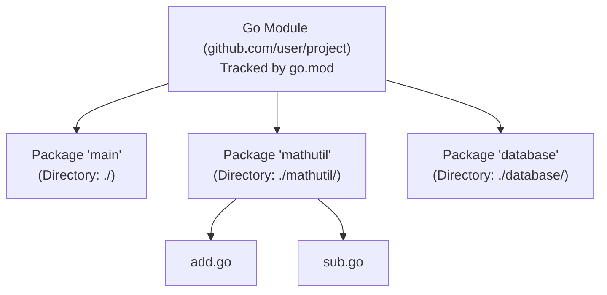

## TL;DR

- A **Package** is a directory containing one or more `.go` files. It is the basic unit of code organization.
- A **Module** is a collection of related packages (usually an entire repository). It is tracked by a `go.mod` file and is the unit of versioning and dependency management.

## Mental Model



## How It Works

### Packages
Every `.go` file must declare which package it belongs to at the very top (`package utils`).
All files in the same directory must belong to the exact same package. 
Code within the same package can access unexported (lowercase) variables and functions from other files in that same package without importing them.

### Modules
Introduced in Go 1.11 to replace the old, painful `GOPATH` system. You initialize a module with `go mod init <module-path>`. This creates a `go.mod` file which acts exactly like `package.json` in Node.js, tracking your dependencies and their exact versions.

## Example

**1. Creating a reusable package (mathutil/add.go)**
```go
// Directory: mathutil
package mathutil

// Uppercase: Exported (Public)
func Add(a, b int) int {
    return a + b
}

// Lowercase: Unexported (Private to the mathutil package)
func logCalculation(msg string) { ... }
```

**2. Using it in the main package (main.go)**
```go
package main

import (
    "fmt"
    // Import the package using the module path + folder path
    "github.com/myusername/myproject/mathutil"
)

func main() {
    result := mathutil.Add(5, 10)
    fmt.Println(result)
    
    // ERROR: unexported name
    // mathutil.logCalculation("done") 
}
```

## Common Interview Questions

### What is the `main` package?
The `package main` is special. It tells the Go compiler that this code should be compiled into an executable binary (an `.exe` or Linux binary). Any other package name compiles into a library that can be imported but not executed directly. The `main` package must contain a `func main()` which acts as the entry point of the application.

### How do you handle circular dependencies between packages?
Go strictly forbids circular dependencies. If Package A imports Package B, and Package B imports Package A, the compiler will instantly fail. To fix this, you must extract the shared logic or shared interfaces into a new, third Package C, and have both A and B import C.
