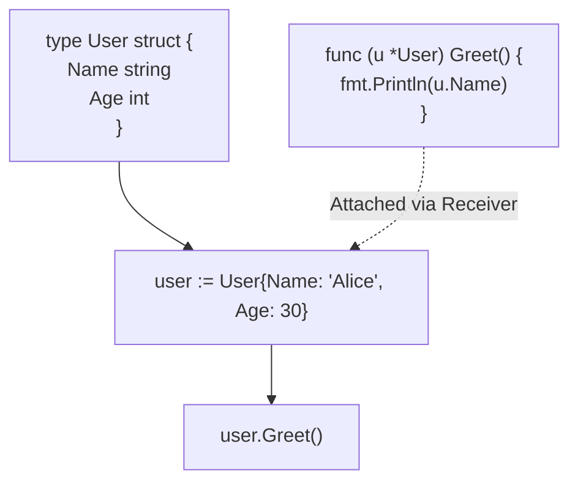

## TL;DR

Go does not have classes or objects. Instead, it relies heavily on **Structs**—typed collections of fields. You can attach methods to structs to simulate object-oriented behavior.

## Mental Model



## How It Works

A struct groups data together. 
To attach behavior (methods) to a struct, you write a normal function but add a **Receiver** argument right before the function name.

There are two types of receivers:
1. **Value Receiver (`u User`)**: Operates on a copy of the struct. Cannot modify the original struct.
2. **Pointer Receiver (`u *User`)**: Operates on a pointer to the struct. Can modify the original struct. This is the most common.

## Example

```go
package main

import "fmt"

// 1. Defining the Struct
type User struct {
	Name  string
	Email string
	Age   int
}

// 2. Method with a Pointer Receiver (Can modify the struct)
func (u *User) UpdateEmail(newEmail string) {
	u.Email = newEmail
}

// 3. Method with a Value Receiver (Read-only)
func (u User) GetProfile() string {
	return fmt.Sprintf("%s (%s)", u.Name, u.Email)
}

func main() {
	// Creating an instance
	admin := User{
		Name:  "Alice",
		Email: "alice@example.com",
		Age:   30,
	}

	// Calling methods
	fmt.Println(admin.GetProfile()) // "Alice (alice@example.com)"
	
	admin.UpdateEmail("admin@company.com")
	
	fmt.Println(admin.Email) // "admin@company.com"
}
```

## Common Interview Questions

### Does Go support inheritance?
No. Go intentionally omits class inheritance (the `extends` keyword in Java/TS). Instead, Go encourages **Composition**. You can embed one struct inside another.
```go
type Logger struct {}
type Server struct {
    Logger // Embedded struct (Composition)
    Port int
}
```
The `Server` struct now magically has access to all the methods of `Logger`.

### How do you make a struct field private?
Go uses **Exported** vs **Unexported** visibility, which is determined entirely by the capitalization of the first letter. 
If a field is `Name string`, it is exported (public to other packages). If it is `name string`, it is unexported (private, accessible only within the same package). There are no `public` or `private` keywords.
