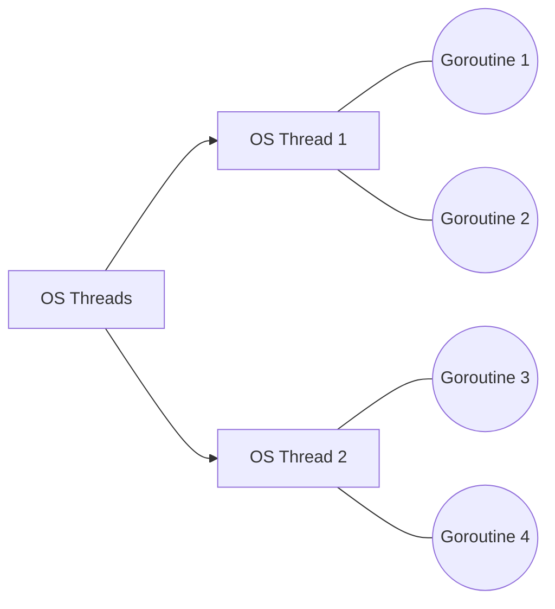

## TL;DR

Goroutines are functions that execute concurrently with other goroutines. They are managed by the Go runtime rather than the OS, making them incredibly lightweight (starting at ~2KB of memory).

## Mental Model


*M:N Scheduling: The Go runtime multiplexes M goroutines onto N OS threads.*

## Example

```go
package main

import (
	"fmt"
	"time"
)

func say(s string) {
	for i := 0; i < 3; i++ {
		time.Sleep(100 * time.Millisecond)
		fmt.Println(s)
	}
}

func main() {
	go say("world") // Runs concurrently
	say("hello")    // Runs synchronously
}
```

## How It Works

1.  **Lightweight**: While a standard Java/C++ thread takes ~1MB of memory for its stack, a Goroutine starts at 2KB and grows/shrinks dynamically. You can easily spawn 100,000 goroutines.
2.  **Scheduling**: The Go scheduler uses an $O(1)$ algorithm to manage goroutines across logical processors (P), mapping to OS threads (M).
3.  **Work Stealing**: If one OS thread finishes all its goroutines, the Go scheduler will "steal" goroutines from another thread's queue to keep CPU utilization high.

## Interview Questions

### What happens if the `main` function returns while goroutines are still running?
When the `main` function returns, the program exits immediately. All active goroutines are abruptly terminated. You must use a `sync.WaitGroup` or channels to wait for them to finish.

### How do goroutines communicate?
"Do not communicate by sharing memory; instead, share memory by communicating." Goroutines predominantly use **Channels** to pass data safely, avoiding race conditions.

## Common Gotchas

*   **Loop variables in goroutines**: (Pre Go 1.22) Launching goroutines inside a `for` loop that reference the loop variable `i` will cause them all to print the final value of `i`, because they share the same memory address. 
    *   *Fix*: Pass `i` as an argument to the goroutine `go func(val int) {}(i)`.

## Remember

> Goroutines are cheap. If you have independent work, don't hesitate to throw a `go` keyword in front of it.
