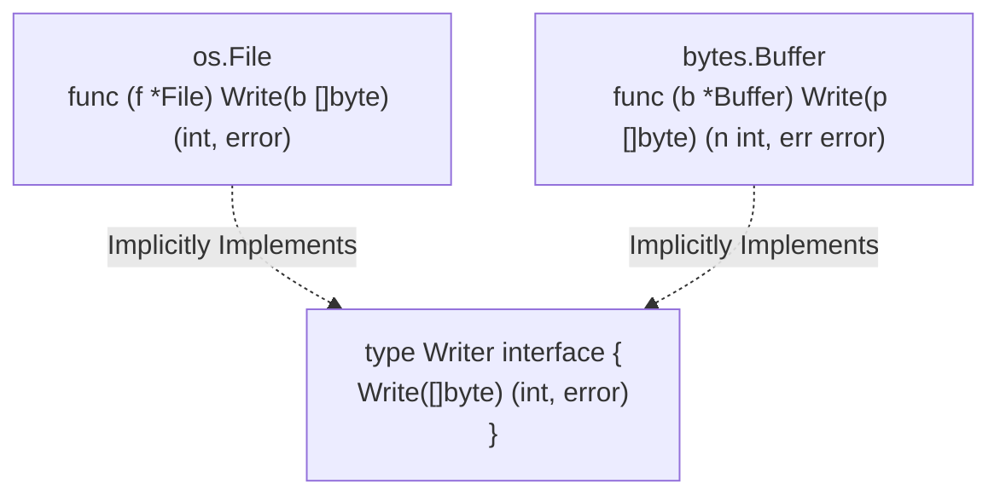

## TL;DR

An interface in Go is a set of method signatures. What makes Go unique is that interfaces are satisfied **implicitly**. You do not explicitly declare that a type implements an interface (no `implements` keyword). If a type has the required methods, it satisfies the interface.

## Mental Model



## Example

```go
package main

import "fmt"

// Define the interface
type Speaker interface {
	Speak() string
}

// Define a concrete type
type Dog struct {
	Name string
}

// Implement the required method.
// Dog now implements Speaker implicitly!
func (d Dog) Speak() string {
	return "Woof!"
}

// A function that accepts any Speaker
func MakeSound(s Speaker) {
	fmt.Println(s.Speak())
}

func main() {
	d := Dog{Name: "Rex"}
	MakeSound(d) // Allowed!
}
```

## How It Works

1.  **Duck Typing**: "If it walks like a duck and quacks like a duck, it's a duck." If your struct has the methods defined in an interface, you can pass your struct anywhere that interface is expected.
2.  **The Empty Interface (`interface{}`)**: An interface with zero methods. Since *every* type has at least zero methods, `interface{}` can hold a value of *any* type (similar to `any` in TypeScript or `Object` in Java).

## Interview Questions

### How do you test if a value is of a specific type?
Using a **Type Assertion**. It extracts the underlying concrete value from the interface.
```go
var i interface{} = "hello"

// Asserts that 'i' holds a string
s, ok := i.(string) 
if ok {
    fmt.Println(s)
}
```

### Why are implicit interfaces powerful?
They decouple packages. You can define an interface in your own package that perfectly matches a struct from a third-party package or the standard library, *without* the third-party package needing to know about your interface.

## Common Gotchas

*   **Pointer vs Value Receivers**: If you implement an interface using a pointer receiver `func (d *Dog) Speak()`, you *cannot* pass a value `Dog{}` to an interface expecting `Speaker`. You MUST pass a pointer `&Dog{}`.

## Remember

> "Accept interfaces, return structs." This is a common Go proverb meaning your functions should take abstract interfaces as arguments, but return concrete structs to the caller.
