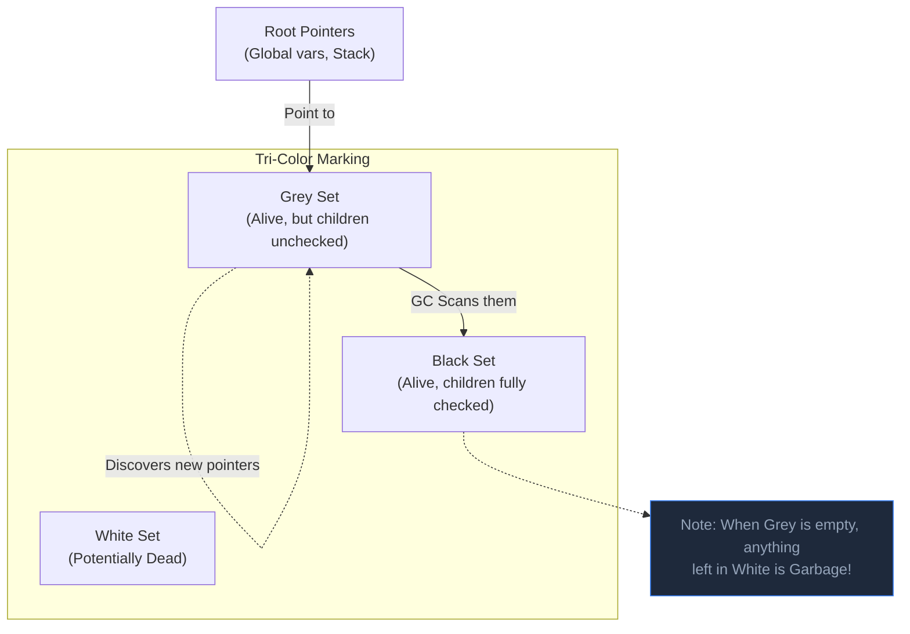

## TL;DR

Go uses a **Concurrent, Tri-Color Mark-and-Sweep Garbage Collector**. It is optimized for extremely low latency (sub-millisecond pauses), meaning it runs alongside your application code rather than freezing your application ("Stop the World") for long periods like older versions of Java.

## Mental Model



## How It Works

The GC only cares about the **Heap**. (The Stack cleans itself instantly).
It operates in two main phases:

1. **Mark Phase (Concurrent)**: 
   - It starts at the "Roots" (global variables and active stack pointers). It colors them Grey.
   - It scans Grey objects for pointers to other objects. When found, it colors the newly found objects Grey, and the original object Black.
   - It repeats this until the Grey set is empty.
   - Everything colored Black is alive. Everything left White is dead garbage.
2. **Sweep Phase (Concurrent)**: 
   - The OS reclaims all the memory occupied by White objects, making it available for future allocations.

Because your app is still running while the GC is scanning, a user might create a *new* pointer while the GC is looking the other way. Go solves this using a **Write Barrier**—a tiny piece of code the compiler injects to notify the GC if a pointer changes during the Mark phase.

## Example (Tuning the GC)

You don't call the GC manually. However, you can tune how aggressively it runs using the `GOGC` environment variable.

- `GOGC=100` (Default): The GC runs when the heap size *doubles* compared to the last sweep. (e.g., if the heap was 10MB after the last sweep, the GC triggers when it hits 20MB).
- `GOGC=50`: GC runs more frequently (when heap grows by 50%). Uses more CPU, but keeps RAM usage lower.
- `GOGC=off`: Turns the GC off entirely! (Rarely used, except for short-lived CLI tools or extreme performance optimizations where memory is pre-allocated).

```go
package main

import (
	"fmt"
	"runtime"
)

func main() {
	var m runtime.MemStats
	
	// Allocate a bunch of memory
	for i := 0; i < 100000; i++ {
		_ = make([]byte, 1024)
	}

	// You can force a GC run manually (almost never recommended in prod)
	runtime.GC() 

	runtime.ReadMemStats(&m)
	fmt.Printf("Heap Allocated: %v KB\n", m.Alloc/1024)
}
```

## Common Interview Questions

### What is a "Stop The World" (STW) pause?
A STW pause is when the Go runtime completely freezes every single user goroutine so the GC can perform critical tasks safely. In Go, STW pauses are incredibly brief (usually under 100 microseconds). There are two tiny STW pauses per GC cycle: one to turn on the Write Barrier before Marking, and one to turn it off before Sweeping.

### How does Go's GC compare to Java's?
Java's GC (traditionally) focuses on maximum *throughput* and uses a "Generational" model (splitting the heap into Young/Old generations). It can achieve higher raw operations-per-second, but suffers from occasional long STW pauses.
Go's GC focuses on minimum *latency*. It does not use generations. It trades a bit of CPU throughput to ensure that web servers never drop requests due to GC pauses.
