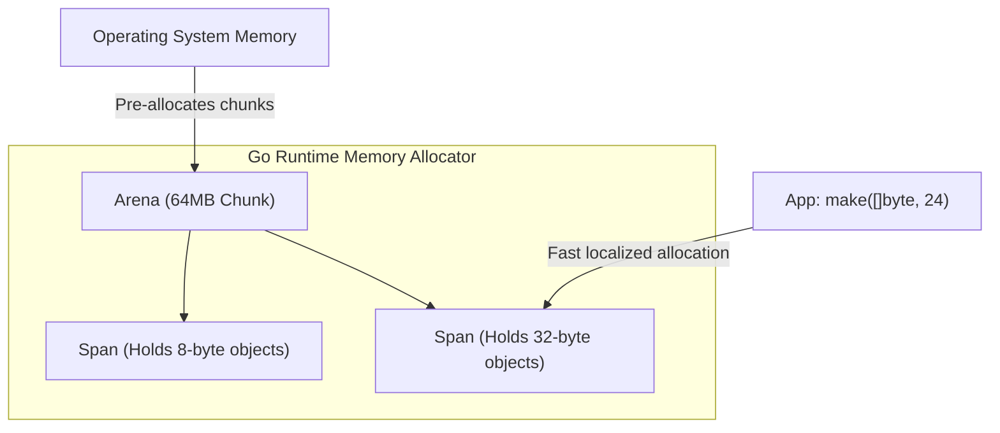

## TL;DR

Go doesn't ask the Operating System for memory every time you create a variable. That would be too slow. Instead, the Go runtime pre-allocates massive chunks of memory from the OS on startup (Arenas) and slices them into smaller, reusable blocks (Spans) using a heavily customized version of the TCMalloc (Thread-Caching Malloc) algorithm.

## Mental Model



## How It Works

1. **Arenas**: Go grabs memory from the OS in massive 64MB blocks called Arenas.
2. **Spans**: It divides Arenas into Pages (8KB). It groups pages together to form Spans. A Span is dedicated to holding objects of a specific size class (e.g., one Span only holds 16-byte objects, another holds 32-byte objects).
3. **mcache (Thread Cache)**: Every OS thread (the 'P' in the GMP model) has its own local cache of Spans. When your goroutine needs memory, it grabs it directly from its local `mcache`. This requires **zero Mutex locks**, making allocation lightning fast!
4. **mcentral**: If the local `mcache` runs out of 32-byte slots, it asks the global `mcentral` for a new Span. This requires a lock, but happens rarely.

## Example

Because memory allocation is abstracted, you don't interact with Spans or Arenas in code. However, you can see the impact of this design when doing performance tuning.

```go
package main

import "fmt"

func main() {
    // If we allocate tiny variables, Go finds a free slot in the local mcache.
    // This is virtually instantaneous and lock-free.
	smallVar := make([]byte, 16) 
	
	// If we allocate a massive variable (> 32KB), Go bypasses the mcache completely.
	// It goes straight to the global heap, which is slower and requires locks.
	massiveVar := make([]byte, 10 * 1024 * 1024) 
	
	fmt.Println(len(smallVar), len(massiveVar))
}
```

## Common Interview Questions

### What happens if I allocate millions of tiny structs vs a few large structs?
Allocating millions of tiny structs (e.g., a massive linked list) is bad for the Garbage Collector. It has to follow millions of pointers. Furthermore, due to "Size Classes" in the spans, a 9-byte object will be placed in a 16-byte slot, wasting 7 bytes of memory (Internal Fragmentation). It is usually more efficient to allocate a single large slice of contiguous memory (an array of structs).

### What is `sync.Pool` and how does it relate to the Allocator?
If your server receives 10,000 HTTP requests per second, and each request creates a 10KB buffer, you are thrashing the memory allocator and the GC. `sync.Pool` allows you to save those 10KB buffers after the request finishes, and hand them to the *next* HTTP request. This completely bypasses the memory allocator and relieves the GC, acting as a manual object recycling bin.
