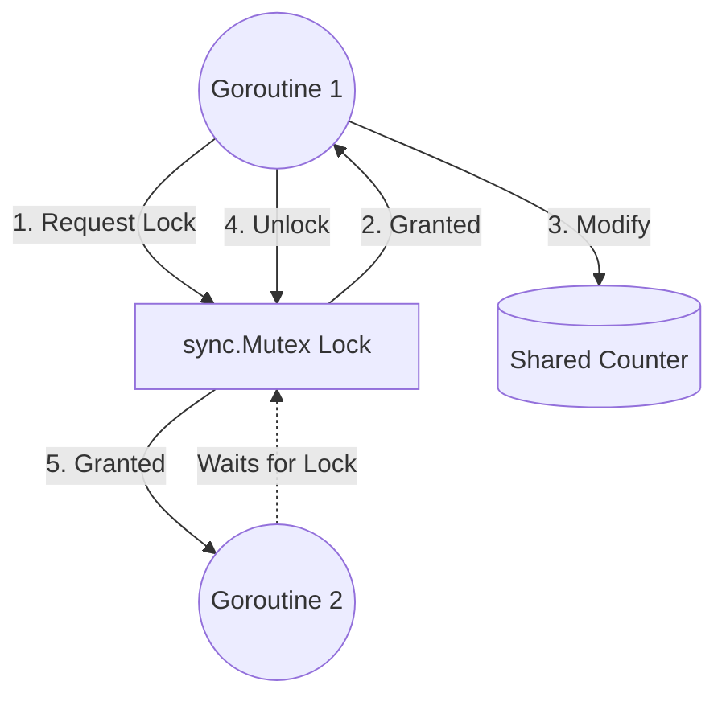

## TL;DR

A Mutex (Mutual Exclusion) provides a lock around a block of code to ensure that only one goroutine can access or modify a shared resource at a time, preventing race conditions.

## Mental Model



## Example

```go
package main

import (
	"fmt"
	"sync"
)

type SafeCounter struct {
	mu sync.Mutex
	v  map[string]int
}

func (c *SafeCounter) Inc(key string) {
	c.mu.Lock()
	defer c.mu.Unlock() // Ensure it unlocks even if a panic occurs
	c.v[key]++
}

func (c *SafeCounter) Value(key string) int {
	c.mu.Lock()
	defer c.mu.Unlock()
	return c.v[key]
}
```

## How It Works

1. **`mu.Lock()`**: If the lock is already in use by another goroutine, the calling goroutine blocks until the lock is available.
2. **`mu.Unlock()`**: Releases the lock. If other goroutines are blocked waiting, one of them will proceed.
3. **`sync.RWMutex`**: A special mutex that allows *multiple readers* or *one writer*. 
   - `RLock()`: Multiple goroutines can hold a read lock simultaneously.
   - `Lock()`: Only one goroutine can hold a write lock. If a write lock is requested, no new read locks are granted until the write completes.

## Interview Questions

### When should you use a Mutex vs a Channel?
- Use **Channels** when passing ownership of data, coordinating/signaling between goroutines, or distributing work.
- Use a **Mutex** for caching, state tracking, and managing simple shared struct fields. "If you're just protecting a counter, a channel is overkill."

### What happens if you forget to `Unlock()` a Mutex?
Deadlock. Any other goroutine that attempts to `Lock()` will block forever, waiting for the lock to be released. This is why you should heavily prefer `defer mu.Unlock()`.

## Common Gotchas

*   **Copying a Mutex by value**: Mutexes must not be copied. If you pass a struct containing a mutex by value to a function, the function gets a *copy* of the mutex state. Always pass by pointer (`*SafeCounter`).

## Remember

> Don't communicate by sharing memory; share memory by communicating. But if you *must* share memory, use a Mutex.
