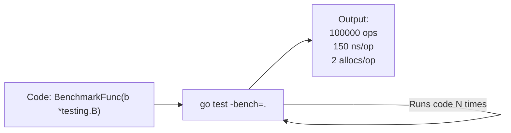

## TL;DR

Go has benchmarking built directly into its testing framework (`testing` package). A Benchmark allows you to run a specific function millions of times to find its exact execution time (down to the nanosecond) and track how many times it forces the Garbage Collector to allocate memory on the heap.

## Mental Model



## How It Works

Benchmark functions live in `_test.go` files right alongside your normal unit tests.
- The function name must start with `Benchmark` (e.g., `BenchmarkStringConcat`).
- It accepts a pointer to `testing.B`.
- It must contain a `for i := 0; i < b.N; i++` loop.
- The Go test runner dynamically adjusts `b.N` (running the loop 1 time, then 100 times, then 1,000,000 times) until the benchmark runs for at least 1 full second, ensuring statistical accuracy.

## Example

```go
// main_test.go
package main

import (
	"strings"
	"testing"
)

// A slow function using standard string concatenation (+)
func concatString(a, b string) string {
	return a + b
}

// A fast function using strings.Builder
func builderString(a, b string) string {
	var builder strings.Builder
	builder.WriteString(a)
	builder.WriteString(b)
	return builder.String()
}

func BenchmarkConcat(b *testing.B) {
	for i := 0; i < b.N; i++ {
		_ = concatString("Hello", "World")
	}
}

func BenchmarkBuilder(b *testing.B) {
	for i := 0; i < b.N; i++ {
		_ = builderString("Hello", "World")
	}
}
```

**Run the benchmark:**
`go test -bench=. -benchmem`

**Output:**
```text
BenchmarkConcat-8    100000000   15.5 ns/op     10 B/op     1 allocs/op
BenchmarkBuilder-8    50000000   28.1 ns/op     16 B/op     1 allocs/op
```
*(Wait, for tiny strings, `+` is actually faster! `strings.Builder` only wins when concatenating many strings in a loop).*

## Common Interview Questions

### What does the `-benchmem` flag do?
It is the most important flag. It tells the test runner to track Heap Allocations. It adds `B/op` (Bytes allocated per operation) and `allocs/op` (How many distinct heap allocations occurred). In high-performance Go, reducing `allocs/op` to `0` is often more important than reducing raw nanoseconds, because fewer allocations mean less Garbage Collection pressure, which prevents latency spikes across the entire server.

### How do you benchmark a function that has an expensive setup phase?
If your function needs to connect to a mock database before running the loop, you don't want the setup time included in the benchmark metrics. Use `b.ResetTimer()` immediately before the `b.N` loop starts to reset the clock.
