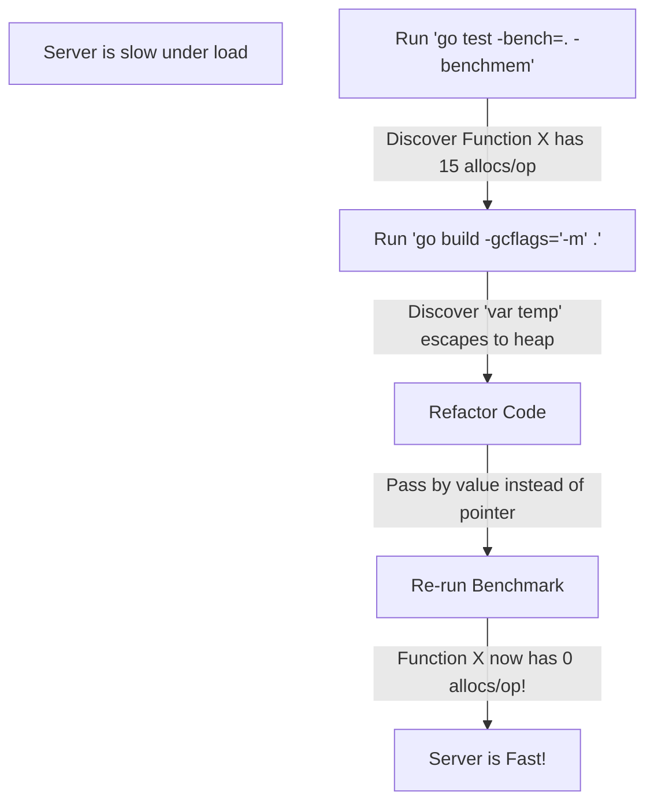

## TL;DR

To make Go code run blisteringly fast, you must minimize Heap Allocations. You use **Benchmarks (`-benchmem`)** to find functions that allocate heavily, and you use the **Compiler's Escape Analysis flag (`-m`)** to find out *why* those variables are being pushed to the heap instead of staying on the fast stack.

## Mental Model



## How It Works

Go is a compiled language, but it acts like a managed language because of the Garbage Collector (GC). The GC scans the Heap. The more objects on the Heap, the harder the GC has to work. If your HTTP handlers allocate hundreds of small structs on the Heap for every request, and you receive 10,000 requests per second, the GC will consume 50% of your CPU just cleaning up.

By rewriting your code so variables stay on the **Stack**, the memory is created and destroyed instantly by the CPU hardware. The GC never even sees it. Zero CPU overhead.

## Example: Optimizing an Allocation

```go
package main

type Config struct {
	Name string
	Port int
}

// SLOW VERSION: Returning a pointer
// 'c' escapes to the Heap because the caller needs its memory address
// after this function exits. (1 allocs/op)
func loadConfigBad() *Config {
	c := Config{Name: "API", Port: 8080}
	return &c 
}

// FAST VERSION: Returning by value
// 'c' stays entirely on the Stack. It is simply copied to the caller.
// (0 allocs/op)
func loadConfigGood() Config {
	c := Config{Name: "API", Port: 8080}
	return c 
}
```

## Common Interview Questions

### Should I pass slices by pointer `*[]int` to improve performance?
**Never.** A slice in Go is already a tiny 24-byte struct (a pointer, length, and capacity). Passing a 24-byte struct by value is virtually instantaneous. If you pass a pointer to a slice (`*[]int`), you are just passing an 8-byte pointer to a 24-byte struct, which saves almost no time, but drastically increases the chance that the slice header escapes to the Heap.

### Are Interface allocations slow?
Yes. If you have a concrete type (like `User`) and you assign it to an interface variable (like `error` or `any`), Go must dynamically box that value. The compiler often cannot prove what will happen to that interface, so it pushes the underlying value to the Heap. This is why passing variables to `fmt.Println(args ...any)` causes heap allocations, and why highly optimized logging libraries like `zap` avoid `interface{}` entirely in favor of strongly-typed fields.
