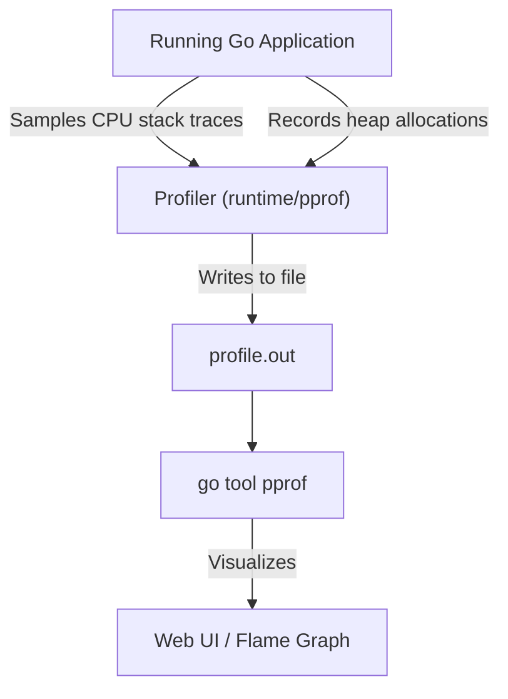

## TL;DR

Go has world-class performance analysis tools built directly into the standard library. **Profiling** allows you to see exactly which functions are consuming the most CPU time, allocating the most memory on the heap, or blocking the most goroutines. 

## Mental Model



## How It Works

There are three main types of profiles in Go:

1. **CPU Profile**: The runtime interrupts the program 100 times per second to record exactly which function is currently executing on the CPU. It aggregates this data to show you where your program spends its processing time.
2. **Memory (Heap) Profile**: Records which functions are responsible for allocating memory on the heap. This is crucial for reducing Garbage Collection pressure.
3. **Block/Mutex Profile**: Records where goroutines are getting stuck waiting for channels, locks, or network I/O.

## Example: Generating a Profile from a Script

If you are writing a CLI tool or a short-lived script, you can use the `runtime/pprof` package directly to write a profile to disk.

```go
package main

import (
	"log"
	"os"
	"runtime/pprof"
)

func heavyComputation() {
	// Simulate intense math
	for i := 0; i < 1000000000; i++ {
		_ = i * i
	}
}

func main() {
    // 1. Create a file to store the CPU profile data
	f, err := os.Create("cpu.prof")
	if err != nil {
		log.Fatal(err)
	}
	defer f.Close()

    // 2. Start the profiler
	if err := pprof.StartCPUProfile(f); err != nil {
		log.Fatal(err)
	}
	// 3. Ensure we stop the profiler before the program exits
	defer pprof.StopCPUProfile()

    // 4. Run the actual code
	heavyComputation()
}
```

After running the script, you analyze the output file using the Go toolchain:
`go tool pprof cpu.prof`

## Common Interview Questions

### Should I run a CPU Profiler in Production?
The overhead of the CPU profiler is usually around **5%**. Many massive companies (like Google and Uber) run Continuous Profiling in production 24/7 because a 5% overhead is worth the invaluable data of seeing exactly what is slowing down real-world requests. For smaller teams, it is common to expose a secret HTTP endpoint (using `net/http/pprof`) to turn the profiler on for 30 seconds to grab a snapshot when the server is misbehaving, then turn it off.

### What is the difference between `runtime/pprof` and `net/http/pprof`?
- `runtime/pprof` is used to manually start and stop profiling, writing the raw binary data to an `os.File`. Useful for CLI tools.
- `net/http/pprof` is used for long-running web servers. It automatically registers HTTP endpoints (like `/debug/pprof/profile`) to your default router, allowing you to trigger profiles over the network on demand using `curl`.
