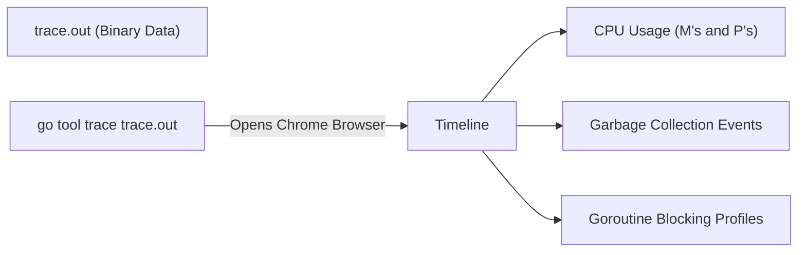

## TL;DR

While the CPU Profiler (`pprof`) tells you *what* code is executing, the **Execution Tracer** (`runtime/trace`) tells you *what code is NOT executing*. It visualizes exactly how Goroutines are scheduled across CPU cores, when they are blocked waiting for Mutexes or Network I/O, and when the Garbage Collector is pausing your app.

## Mental Model



## How It Works

The tracer records nanosecond-level events. It tracks every single time a goroutine is created, blocked, unblocked, or destroyed. It also records network latency, syscalls, and GC pauses.

You use it when `pprof` isn't helping. If your API is slow, but `pprof` shows very low CPU usage, it means your goroutines are spending all their time *asleep* (blocked). The Tracer will show you exactly what they are waiting for (e.g., a highly contested `sync.Mutex`, or a slow database response).

## Example

Generating a trace from a test is the easiest method.

```go
// main_test.go
package main

import (
	"testing"
	"time"
)

func TestSomethingSlow(t *testing.T) {
	// Simulate work that sleeps
	time.Sleep(100 * time.Millisecond)
}
```

**Run the test and generate a trace file:**
`go test -trace=trace.out`

**Open the trace file in the web UI:**
`go tool trace trace.out`

This will open your browser. Click on "View trace" to see the massive, colorful timeline showing every CPU core (`PROCS`) and the exact microsecond your goroutines moved between the `Runnable`, `Running`, and `Waiting` states.

## Common Interview Questions

### Can I run the Execution Tracer in production?
**No, absolutely not.** Unlike the CPU Profiler (which samples 100 times a second), the Tracer records *every single event*. On a highly concurrent server, this will generate hundreds of megabytes of data per second and severely degrade the performance of the server. It is strictly used in development, testing, or isolated staging environments for brief periods.

### What is the "Network Poller" in the Trace view?
When a goroutine makes an HTTP request, it doesn't block the underlying OS Thread. The goroutine is put to sleep, and the network socket is handed to the Go runtime's "Network Poller" (which uses `epoll` on Linux). When the OS signals that the HTTP response has arrived, the Network Poller wakes up the goroutine and puts it back in the Run Queue. The trace visualizes this handoff perfectly.
